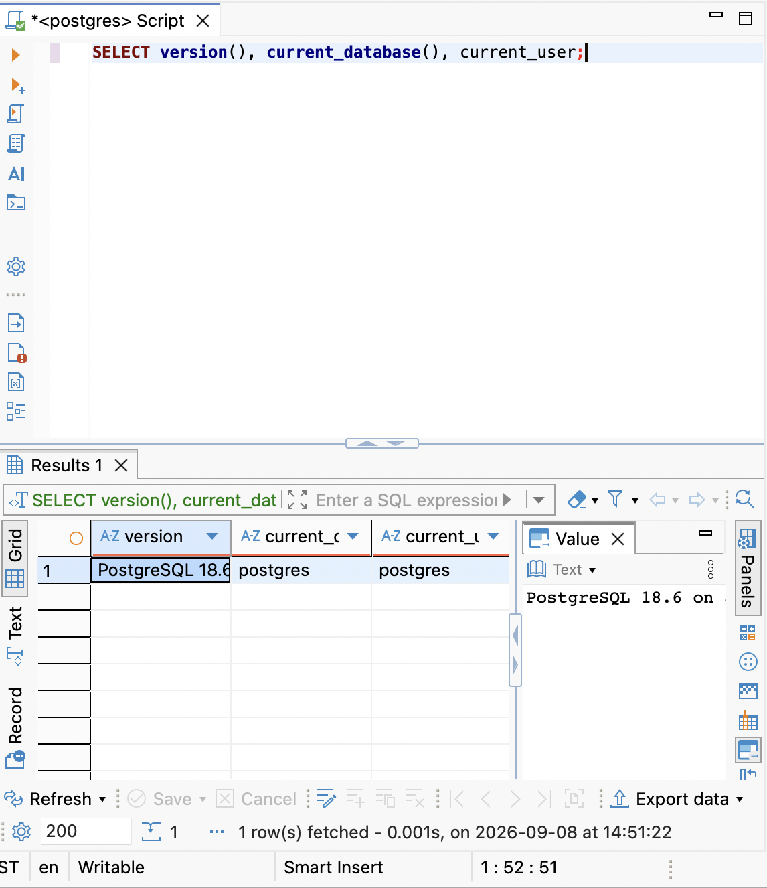
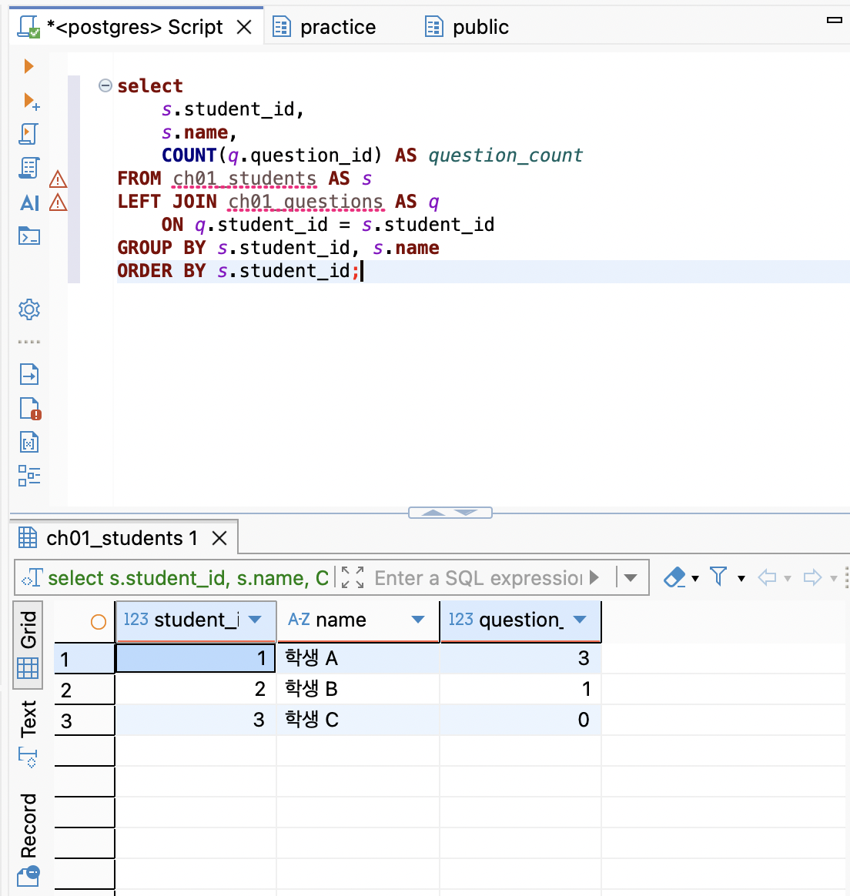
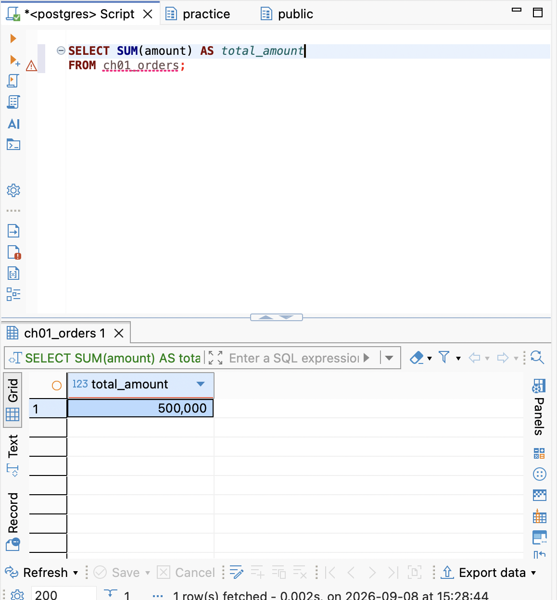
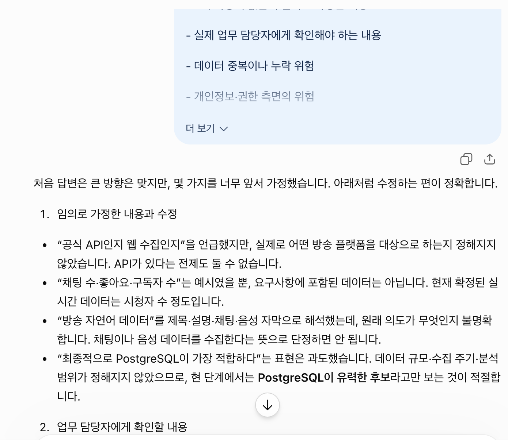

# Chapter 01 확장 실습 답안 템플릿

> **과제:** AI 시대에 데이터베이스를 왜 배워야 하는가  
> **사용 방법:** 이 파일을 내려받아 **본인의 GitHub 저장소**에 `chapter01_answer.md`라는 이름으로 저장한 뒤 답안을 작성합니다.  
> **제출 방법:** LMS에는 파일을 업로드하지 않고, **본인 GitHub 저장소의 `chapter01_answer.md` 파일 URL**을 제출합니다.

---

## 0. 학생 정보

| 항목 | 작성 내용 |
| --- | --- |
| 학번 |  |
| 이름 |  |
| GitHub 계정 |  |
| 과제 작성일 |  |
| 사용한 AI 도구 |  |

> 실제 비밀번호, API Key, 전체 DB 접속 URL, 개인정보는 이 파일이나 캡처 화면에 기록하지 않습니다.

---

# 1. PostgreSQL 실행 환경 확인

## 1-1. 실행한 SQL

```sql
SELECT version();
SELECT current_database();
SELECT current_user;
SELECT CURRENT_TIMESTAMP;
```

## 1-2. 실행 결과 기록

```text
PostgreSQL 버전: PostgreSQL 18.6 on aarch64-apple-darwin24.6.0, compiled by Apple clang version 17.0.0 (clang-1700.0.13.5), 64-bit
현재 데이터베이스: postgres
현재 사용자: postgres
현재 시각:2026-09-08 14:48:30.299 +0900
```

## 1-3. 내가 확인한 내용

1. SQL을 작성하는 프로그램과 PostgreSQL은 같은 프로그램인가요?

```text
나의 답: 같은 프로그램이 아니다. PostgreSQL은 데이터를 저장·관리하고 SQL을 실제로 실행하는 데이터베이스이고, 작성은 DBeaver나 코드 작성기 프로그램 등에서 SQL을 작성한다. 다만 최근 Cloud DB 서비스의 경우 BigQuery, Clickhouse 등 저장과 작성 모두를 같은 프로그램 내에서 실행할 수도 있다.
```

2. `current_database()` 결과는 무엇을 의미하나요?

```text
나의 답: 현재 SQL을 실행 중인 데이터베이스의 이름을 의미한다.
```

3. SQL이 실행되었다는 사실만으로 데이터 내용도 올바르다고 할 수 있나요?

```text
나의 답: 아니다. SQL이 오류 없이 실행되었다는 것은 문법과 실행 조건에 문제가 없었다는 뜻일 뿐, 결과가 의도한 데이터인지까지 보장하지는 않는다. 
```

## 1-4. 증거 화면

아래 경로에 캡처 이미지를 저장하는 것을 권장합니다.

```text
assignments/chapter01/images/step01_environment.png
```

이미지를 저장했다면 아래 링크의 파일명을 실제 파일명에 맞게 수정합니다.

```markdown

```

**이미지 삽입 위치:**

<!-- 아래 줄의 주석을 지우고 실제 이미지 Markdown을 넣어도 됩니다. -->

`여기에 STEP 1 증거 화면을 삽입하세요.`

---

# 2. Chapter 01 핵심 내용 복습

교재 문장을 그대로 복사하지 말고 자신의 말로 작성합니다.

| 본문의 핵심 | 나의 설명 |
| --- | --- |
| AI가 SQL을 만들어도 DB를 배워야 한다 | 충분히 배워야한다고 생각한다. 왜냐하면 DB의 설계와 SQL의 작성/실행은 다를 뿐더러 그 구조를 이해해야만이 효율적이고 정확한 쿼리 작성이 가능하다고 생각한다. |
| 데이터 구조가 중요하다 | 데이터 구조는 단순 그 구조를 파악하는 것뿐 아니라 각 구조의 기능 및 테이블-스키마 간 관계를 읽는 것이 중요할 것 같다. |
| SQL 결과를 검증해야 한다 | 반드시 검증해야 한다. 조건을 어떤 방식으로 달았는지, 데이터의 전처리는 완벽했는지, 각 쿼리가 반복되어 집계되진 않았는지를 점검해야 한다. |
| 데이터 품질이 AI 답변 품질에 영향을 준다 | 반드시 영향을 줄 것이다. 첫 번째, 쿼리의 실행 자체에 영향을 준다. 만약 null로 빈 칸이 있거나, 데이터 형식이 맞지 않는다면 쿼리 실행 자체에 오류가 걸릴 것이다. 또한, 데이터의 상세 정보 및 품질에 대한 정보를 주지 않을 경우 AI의 답변은 매우 현실과 동떨어지거나 할루시네이션이 일어날 것이다. |
| 저장 방식은 데이터 양만 보고 선택하지 않는다 | 그렇다. 데이터의 품질 및 성질을 고려해야할 것이다. 특히 비정형 데이터가 많아지고 이를 분석하고자 하는 노력이 많아지는 추세이므로 이러한 부분에 대한 고려가 필요하다. |

## 가장 중요하다고 생각한 한 문장

```text

```

---

# 3. 실행 성공과 결과 정확성의 차이

## 3-1. SQL 실행 전 예상

학생 A는 질문 2개, 학생 B는 질문 1개, 학생 C는 질문이 없습니다.

```text
전체 학생 수: 3 명
전체 질문 수: 3 개
질문이 있는 학생 수: 2 명
질문이 없는 학생 수: 1 명
```

## 3-2. 임시 테이블 생성 및 데이터 입력 완료 확인

- [ O ] `ch01_students` 생성
- [ O ] `ch01_questions` 생성
- [ O ] 학생 3명 입력
- [ O ] 질문 3건 입력
- [ O ] 두 테이블의 데이터를 직접 조회

## 3-3. 잘못된 학생 수 SQL 실행 결과

실행한 SQL:

```sql
SELECT COUNT(*) AS student_count
FROM ch01_students AS s
INNER JOIN ch01_questions AS q
    ON q.student_id = s.student_id;
```

실행 결과: 3

```text

```

## 3-4. JOIN 상세 결과 관찰

```text
학생 A가 나타난 행 수: 2행
학생 B가 나타난 행 수: 1행
학생 C가 나타난 행 수: 0행
```

다음 질문에 답합니다.

### Q1. 학생 C가 왜 결과에서 사라졌나요?

```text
INNER JOIN의 경우 두 테이블에서 모두 값이 있을 때 그 교집합을 나타내는 함수이다. 학생 C의 경우 question 테이블에서 그 student_id를 key로 가지는 행이 없으므로 교집합에 해당하지 않는다.
```

### Q2. 학생 A가 왜 여러 행으로 나타났나요?

```text
학생 A는 질문 테이블에서 2개 행으로 student_id가 존재하기 때문에 그 행 모두가 교집합에 해당하므로 두 행으로 나타난다. 
```

### Q3. 위 `COUNT(*)`가 실제로 세고 있었던 것은 무엇인가요?

```text
질문들 중 학생 ID가 학생 DB에 존재하는 질문들의 개수에 가깝다. 
```

### Q4. 결과 숫자가 우연히 실제 학생 수와 같아도 바로 믿으면 안 되는 이유는 무엇인가요?

```text
해당 쿼리가 내가 원하는 로직이 아닌 전혀 다른 사항을 의미할 수 있기 때문이다.
```

## 3-5. 질문 한 건을 추가한 뒤 다시 실행

추가한 데이터:

```text
학생 A가 한 4번째 질문
```

다시 실행한 결과: 4

```text
AI SQL 결과:4
실제 학생 수: 3
```

### 결과 해석

```text
데이터가 바뀐 뒤 무엇이 달라졌는지: 질문 행이 하나 추가되었다.

실제 학생 수는 왜 그대로인지: 기존 DB에 있던 학생이 추가로 질문을 한 것이기 때문이다.

이 실험을 통해 알게 된 점: TABLE 간 컬럼 연결에 있어 혼동이 있어선 안 된다.
```

## 3-6. 학생 테이블을 직접 센 결과

```sql
SELECT COUNT(*) AS student_count
FROM ch01_students;
```

결과: 3

```text

```

### 두 SQL의 차이를 내 말로 설명

```text
첫 번째 SQL은 학생 DB 및 질문 DB에 정보(student_id)가 있는 학생들이 한 질문의 개수를 세고 있었다.

두 번째 SQL은 학생 자체의 수를 세고 있었다. (다만 중복행을 그대로 처리하므로 만약 정확한 학생수를 세고 싶다면 UNIQUE 내지는 distinct를 사용해야 한다)

따라서 SQL을 검토할 때는 문법보다 먼저
각 DB 내의 컬럼과 그 의미, 그리고 내가 무엇을 파악하려는 정보가 데이터 구조 안에 어떻게 구현되어 있는지를 확인해야 한다.
```

## 3-7. 증거 화면

권장 경로:

```text
assignments/chapter01/images/step03_join_result.png
```

`여기에 STEP 3 핵심 증거 화면을 삽입하세요.`

---

# 4. 잘못된 데이터가 결과를 바꾸는 과정

## 4-1. 주문 데이터 확인

다음 데이터를 입력한 뒤 실제 결과를 확인합니다.

```text
ORD-001, 100000
ORD-002, 200000
ORD-002, 200000
```

## 4-2. 실행 전 예상

업무적으로 주문이 `ORD-001`, `ORD-002` 두 건이고 `order_code`가 주문을 고유하게 구분한다고 **가정할 경우** 예상 합계:

```text
300000 원
```

> 위 가정 자체가 실제 업무 규칙인지 확인해야 한다는 점도 기억합니다.

## 4-3. SQL 합계

```sql
SELECT SUM(amount) AS total_amount
FROM ch01_orders;
```

실제 결과:

```text
500000 원
```

## 4-4. 결과 해석

### `SUM` 문법 자체가 잘못된 것인가요?

```text
SUM은 해당 row의 숫자 모두를 합계하므로 만약 해당 DB에 주문 ID가 DISTINCT하게 존재했다면 전혀 문제가 없었을 것이다.
```

### 결과 차이의 원인은 무엇인가요?

```text
데이터 자체에 중복의 문제가 있다. 
```

### SQL이 정확하게 실행되어도 업무 숫자가 잘못될 수 있는 이유를 설명하세요.

```text
데이터 저장에서 중복의 문제가 생긴다던지의 전처러의 문제가 있기 떄문이다.
```

## 4-5. AI에게 같은 데이터를 분석시킨 결과

AI가 계산한 합계:

```text
전체 레코드 기준 합계: 500,000원
중복 주문번호를 하나의 주문으로 본 합계: 300,000원
```

AI가 중복 가능성을 언급했나요?

```text
언급했다.다만 확인이 필요하다고 덧붙였다.
```

AI가 `ORD-002` 두 행이 실제 두 주문인지 중복 입력인지 스스로 확정할 수 있나요? 이유도 적으세요.

```text
주문 ID는 주문을 식별하는 식별값으로 보통 unique한 키로 사용할 가능성이 높으므로 중복 입력의 가능성이 높다고 판단된다.
```

추가로 확인해야 할 업무 규칙:

```text
1. 오더 아이디가 중복 없는 고유한 값인지?
2. 같은 사람의 같은 금액 주문은 어떤 식으로 처리되는지?
3.
```

내가 최종적으로 내린 판단:

```text
AI는 데이터에 없는 업무 규칙을 자동으로 알 수 없다.
```

## 4-6. 증거 화면

권장 경로:

```text
assignments/chapter01/images/step04_duplicate_result.png
```

`여기에 STEP 4 핵심 증거 화면을 삽입하세요.`

---

# 5. 파일·스프레드시트·DBMS 선택 연습

각 사례에 대해 **AI에게 묻기 전에 먼저 본인의 판단을 작성**합니다.

## 사례 A. 개인 독서 기록

```text
나의 선택: 구글 스프레드 시트
선택 이유: 모바일로 접근이 간편하고, 서치나 분석의 목적이 강하지 않은 기록 성향의 데이터이므로
어떤 조건이 추가되면 다른 방식으로 바꿀 것인지: 책의 개수 및 분류가 늘어나고, 이를 바탕으로 내 독서 성향을 분석하고 예측, 예상 별점 예측 서비스 등으로 발전시킬 경우
```

## 사례 B. 동아리 행사 신청 명단

```text
나의 선택: 구글 스프레드 시트
선택 이유: 공동으로 편집이 간편하고 참석률 계산 정도는 엑셀 함수 등으로 간편히 해낼 수 있기 때문이다. 또한 이후 피봇 테이블 등의 기능으로 행사 성과 등도 간단히 파악 가능하다.
어떤 조건이 추가되면 다른 방식으로 바꿀 것인지: 딱히 없다.
```

## 사례 C. 온라인 강의 서비스

```text
나의 선택: 클라우드 서비스 내에 데이터 베이스 구축 후 쿼리로 관리 
선택 이유: 만일 혼자 관리한다면 로컬 컴퓨터 내에 구축하거나 엑셀 파일로 저장하겠으나 여러 사람에게 권한 및 백업/복구가 필요하므로 클라우드 서비스가 괜찮을 거 같다.
어떤 조건이 추가되면 다른 방식으로 바꿀 것인지: 만약 반복되는 작업이 없고 수정할 사항이 많아진다면 엑셀 스프레드 시트로 넘어갈 수도 있을 것 같다. 
```

## 판단 기준 체크

- [ o ] 데이터 증가
- [ o ] 여러 사용자의 동시 수정
- [ o ] 데이터 사이의 관계
- [ ] 반복 조회와 집계
- [ ] 정확성·일관성
- [ o ] 변경 이력
- [ o ] 권한 구분
- [ o ] 백업·복구
- [ o ] 웹·앱에서 지속 사용

### 데이터가 적으면 무조건 스프레드시트를 사용해야 하나요?

```text
나의 답: 그렇다기보다는 반복 조회 및 집계, 그리고 컬럼의 개수, 백업/복구 등의 사유가 추가될 수 있다.
```

---

# 6. 나만의 서비스 데이터 구조 초안

> 이 내용은 이후 Chapter에서 계속 확장할 수 있으므로 신중하게 작성합니다.

## 6-1. 서비스 정의

```text
서비스 이름: 실시간 방송 데이터 대시보드 서비스 

이 서비스는
실시간 방송 데이터가 어떻게 변하고 어떠한 특징을 가지는지를 실시간 대시보드 형태로 제시하여 방송 생태계를 알아볼 수 있도록
하기 위한 서비스이다.
```

## 6-2. 관리할 데이터 후보

```text
1. 방송 내부 데이터 (방송 이름, 카테고리 등)
2. 방송 실시간 데이터 (시청자 수 등)
3. 방송 관계도 데이터 (합방, 카테고리 등) --> 수집 가능성 확인 필요
4.
5.
```

## 6-3. 한 행의 의미

| 데이터 후보 | 한 행의 의미 |
| 방송 내부 데이터 한 행 | 1분 당 정보 (00초 기준) |
| 방송 실시간 데이터 한 행 | 1분 당 정보 (00초 기준) |
| 방송 관계도 데이터 한 행 | 방송 당 정보 |
| 방송 자연어 데이터 한 행 | 방송 내 채팅 로그 1줄 |

## 6-4. 관계를 자연어로 설명

```text
방송 내부 데이터는 방송 이름 및 시점으로 그룹됨. 이 그룹은 방송 실시간 데이터을 묶으며
방송 실시간 데이터는 스트리머 명, 카테고리, 방송 이름 차레의 순서로 group 되며 이를 통해 추이를 분석하게 된다.
방송 자연어 데이터는 방송 내부 데이터 아래에 속하며 해당 시간대 메인 방송을 기준으로 수집된다.
방송 관계도 데이터는 방송 내부 데이터와 관계 맺으며 해당일의 방송의 관계를 개략적으로 수집한다. 
```

## 6-5. 아직 결정하지 않은 정책

```text
- [질문 1] 무엇을 기준으로 방송 하나로 판단할지?
- [질문 2] AI 방송 분석에 있어 어디까지를 소스로 줄지?
- [질문 3] 방송 지형도에 기본적으로 알고 있는 배경지식을 미리 넣을지 아니면 기본적으로 0인 상태에서 분석을 시킬지?
```

> 확정되지 않은 정책을 AI가 임의로 결정한 경우 그대로 받아들이지 않습니다.

---

# 7. AI를 검토자로 활용하기

## 7-1. 내가 AI에게 전달한 핵심 프롬프트

개인정보나 비밀번호 등 민감한 내용은 제거한 뒤 기록합니다.

```text
나는 데이터베이스를 처음 배우는 학생입니다.

아직 ERD나 정규화를 배우기 전입니다.

내가 생각한 서비스는 다음과 같습니다.

서비스: 실시간 방송 데이터 대시보드 서비스
목적: 이 서비스는 실시간 방송 데이터가 어떻게 변하고 어떠한 특징을 가지는지를 실시간 대시보드 형태로 제시하여 방송 생태계를 알아볼 수 있도록 하기 위한 서비스이다.

관리할 데이터 후보:

방송 내부 데이터 (방송 이름, 카테고리 등)
방송 실시간 데이터 (시청자 수 등)
방송 관계도 데이터 (합방, 카테고리 등) --> 수집 가능성 확인 필요

내가 생각한 관계:

방송 내부 데이터는 방송 이름 및 시점으로 그룹됨. 이 그룹은 방송 실시간 데이터을 묶으며

방송 실시간 데이터는 스트리머 명, 카테고리, 방송 이름 차레의 순서로 group 되며 이를 통해 추이를 분석하게 된다.

방송 자연어 데이터는 방송 내부 데이터 아래에 속하며 해당 시간대 메인 방송을 기준으로 수집된다.

방송 관계도 데이터는 방송 내부 데이터와 관계 맺으며 해당일의 방송의 관계를 개략적으로 수집한다.
아직 결정하지 못한 정책:

- [질문 1] 무엇을 기준으로 방송 하나로 판단할지?

- [질문 2] AI 방송 분석에 있어 어디까지를 소스로 줄지?

- [질문 3] 방송 지형도에 기본적으로 알고 있는 배경지식을 미리 넣을지 아니면 기본적으로 0인 상태에서 분석을 시킬지?

지금 단계에서는 완성된 SQL을 만들지 말고,

1. 내가 놓친 데이터가 있는지,

2. 서로 다른 의미의 데이터를 한 항목으로 섞은 것은 없는지,

3. 추가로 확인해야 할 업무 질문은 무엇인지,

4. 파일·스프레드시트·관계형 DBMS 중 무엇이 적합해 보이는지

초보자가 이해할 수 있게 검토해 주세요.

확정되지 않은 정책은 임의로 정답처럼 결정하지 마세요.
```

## 7-2. AI의 주요 제안과 나의 판단

최소 5개를 작성합니다.

| AI의 제안 | 수용 / 수정 / 거절 | 나의 판단 근거 |
| --- | --- | --- |
| 추가로 고려할 데이터: 플랫폼, 스트리머 식별값, 방송 식별값,방송 상태: 라이브 중인지, 종료됐는지, 시작·종료 시각 | 수용 | 데이터베이스의 핵심이 될 것으로 판단
| 지표의 범위: 동시 시청자 수 외에 좋아요·채팅 수·구독자 수 등을 다룰지 | 보류 | 수집 가능한지 여부의 확인이 필요, 수집 가능하다면 수용 |
| 합방 관계는 자동으로 판단할 것인가, 사용자가 입력할 것인가를 정해야 함 | 수용 | 기존엔 사용자가 입력할 것으로 판단했으나 자동화 가능성 검토 필요 |
| 관계형 DBMS(PostgreSQL)가 가장 적합 | 수용 | 소량 데이터를 스프레드시트로 먼저 정의 → API 원본은 파일로 보관 → 분석용 데이터는 PostgreSQL에 저장 |
| 시계열적 데이터 분석 가능성 | 수정 | 우선 기본적인 틀을 만든 후 추후에 검토 예정 |

## 7-3. AI에게 자기 답변을 다시 비판하도록 요청한 결과

첫 번째 답변과 달라진 점:

```text
“공식 API인지 웹 수집인지”을 언급했지만, 실제로 어떤 방송 플랫폼을 대상으로 하는지 정해지지 않았습니다. API가 있다는 전제도 둘 수 없습니다.
“채팅 수·좋아요·구독자 수”는 예시였을 뿐, 요구사항에 포함된 데이터는 아닙니다. 현재 확정된 실시간 데이터는 시청자 수 정도입니다.
“방송 자연어 데이터”를 제목·설명·채팅·음성 자막으로 해석했는데, 원래 의도가 무엇인지 불명확합니다. 채팅이나 음성 데이터를 수집한다는 뜻으로 단정하면 안 됩니다.
“최종적으로 PostgreSQL이 가장 적합하다”는 표현은 과도했습니다. 데이터 규모·수집 주기·분석 범위가 정해지지 않았으므로, 현 단계에서는 PostgreSQL이 유력한 후보라고만 보는 것이 적절합니다.
```

AI가 처음에 임의로 가정했던 내용:

```text
대상 플랫폼과 수집 가능 데이터가 API로 접근이 가능할 것이라는 점
자연어 데이터를 댓글에 한정한 점
방송 이력의 기준을 실시간으로 남기는 게 아닌 최종적으로 방송 종료 시점만을 고려한 것
```

추가로 업무 담당자에게 확인해야 한다고 판단한 내용:

```text
대상 플랫폼과 수집 가능 데이터는 무엇인가?
“실시간”은 실제 초 단위에 가까운 갱신인지, 1분·5분 단위 수집인지?
방송 하나를 구분하는 기준은 무엇인가? 플랫폼 방송 ID가 있는가?
방송 중 제목·카테고리가 바뀌면 변경 이력을 남겨야 하는가, 마지막 값만 남기면 되는가?
합방은 누가, 어떤 근거로 판단하는가?
자연어 데이터의 정확한 범위는 무엇인가?
대시보드의 우선 사용자는 누구이며, 가장 중요한 분석 질문은 무엇인가?
```

## 7-4. AI 활용에 대한 나의 평가

```text
가장 유용했던 부분: 내가 자연어로 주는 조건과 두루뭉술한 프로젝트 내용들에서 어떤 식으로 프로젝트를 구조화하면 좋을지에 대한 얼개를 잡아주니 디테일한 부분으로 파고들기 간편했다.

수정하거나 거절한 부분: 다만 정확한 최신 정보나 실제 프로젝트에 관련된 사항들 전체를 업데이트하지 못하고 있으므로 이러한 부분에 대해선 직접 서치가 필요해 보였다.

그렇게 판단한 근거: 왜냐하면 실현 가능성보다는 그 구조의 실재 가능성 내지는 정합성에 더욱 집중하는 듯 했기 때문이다.

AI가 없었다면 놓쳤을 가능성이 있는 질문: 방송 하나를 구분하는 기준은 무엇인가? 
```

## 7-5. AI 활용 증거 화면

권장 경로:

```text
assignments/chapter01/images/step07_ai_review.png
```

AI 대화 전체를 캡처할 필요는 없습니다. 핵심 요청과 검토 과정이 보이는 화면 1장 정도면 충분합니다.

`여기에 AI 활용 증거 화면을 삽입하세요.`

---

# 8. 기준 데이터·파생 데이터·AI 생성 결과 구분

내 서비스에 맞게 작성합니다.

| 구분 | 내 서비스의 예 | 판단 이유 |
| --- | --- | --- |
| 기준 데이터 | 방송 실시간 데이터 | 방송 실시간으로 집계하여 모든 서비스의 근간이 되는 기준 데이터 |
| 파생 데이터 | 추이 변동 데이터 | 실시간 데이터를 기반으로 집계를 비교해 생성된 파생 데이터 |
| AI 생성 결과 | AI의 방송 지형도 예측 | 기존 추이와 카테고리 등 내부 데이터를 결합해 이후 방송 지형/성과 예측 |

### 기준 데이터가 변경되면 파생 데이터는 어떻게 해야 하나요?

```text
기준 데이터가 수정·삭제되면, 그 데이터를 바탕으로 만든 결과도 현재 기준 데이터와 일치하는지 다시 확인해야 한다. 그렇지 않으면 원본은 바뀌었는데 대시보드나 분석 결과에는 이전 값이 남을 수 있다.
```

### AI 결과만 있고 원본 데이터가 없다면 결과를 충분히 검증할 수 있나요?

```text
충분히 검증하기 어렵다. AI 결과만으로는 어떤 원본 데이터를 사용했는지, 데이터가 정확했는지, 어떤 조건이나 기준으로 결과가 만들어졌는지 확인할 수 없기 때문이다.. 따라서 AI 결과를 활용하더라도 원본 데이터의 분석 기준을 남겨야 한다.
```

---

# 9. 최종 성찰

아래 세 문장은 반드시 **본인의 말**로 작성합니다.

```text
1. SQL이 실행되어도 결과를 바로 믿으면 안 되는 이유는
   그 결과가 나온 과정이 DB 구조에 따라 천차만별이기 때문이다.

2. AI를 데이터베이스 학습에 활용할 때 가장 중요한 것은
   정확한 지시와 구조 전달, 그리고 수정이다.

3. 이번 실습 이후 내가 더 확인하고 싶은 것은
   AI를 활용한 데이터 파이프라인 및 분석 자동화 에이전트이다.
```

## 이번 Chapter에서 새롭게 알게 된 점 3가지

```text
1. Postgres와 DBeaver를 활용한 로컬 데이터베이스 구축
2. Git을 웹이 아닌 터미널로 구현하는 법
3. 
```

## 아직 이해가 명확하지 않은 부분

```text
1. Git 연결의 정확한 원리 및 응용
2.
```

---

# 10. 제출 전 자기 점검

- [o] PostgreSQL 실행 화면을 확인했다.
- [o] SQL 실행 전에 예상 결과를 먼저 작성했다.
- [o] `INNER JOIN` 예제에서 누락과 반복을 설명할 수 있다.
- [o] 숫자가 우연히 같아도 의미가 다를 수 있음을 설명했다.
- [o] 중복 데이터가 집계 결과에 미치는 영향을 확인했다.
- [o] 저장 방식을 데이터 양만으로 판단하지 않았다.
- [o] 개인 서비스 주제를 하나 정했다.
- [o] 데이터 후보와 한 행의 의미를 작성했다.
- [o] 미확정 정책을 최소 3개 작성했다.
- [o] AI 제안을 수용·수정·거절로 구분했다.
- [o] AI 제안에 대한 판단 근거를 작성했다.
- [o] 기준 데이터·파생 데이터·AI 결과를 구분했다.
- [o] 핵심 증거 이미지가 Markdown에서 정상적으로 보인다.
- [o] 비밀번호·API Key·개인정보가 노출되지 않았다.

---

# 11. LMS 제출 정보

## 내 GitHub 답안 파일 URL

아래에는 **교수자 템플릿 URL이 아니라 본인이 작성한 답안 파일의 GitHub URL**을 기록합니다.

```text
https://github.com/<본인-GitHub-ID>/<본인-저장소>/blob/main/assignments/chapter01/chapter01_answer.md
```

내 실제 제출 URL:

```text

```

> LMS에는 위 **본인 저장소의 `chapter01_answer.md` 파일 URL 하나**를 제출합니다.

---

## 권장 학생 저장소 구조

```text
<본인-저장소>/
└── assignments/
    └── chapter01/
        ├── chapter01_answer.md
        └── images/
            ├── step01_environment.png
            ├── step03_join_result.png
            ├── step04_duplicate_result.png
            └── step07_ai_review.png
```

이 구조를 사용하면 이후 Chapter 02, Chapter 03도 같은 방식으로 계속 추가할 수 있습니다.
