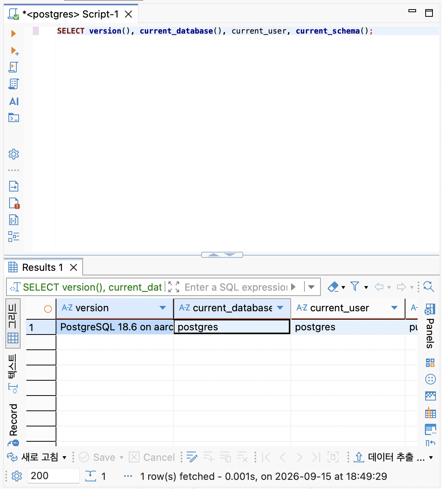
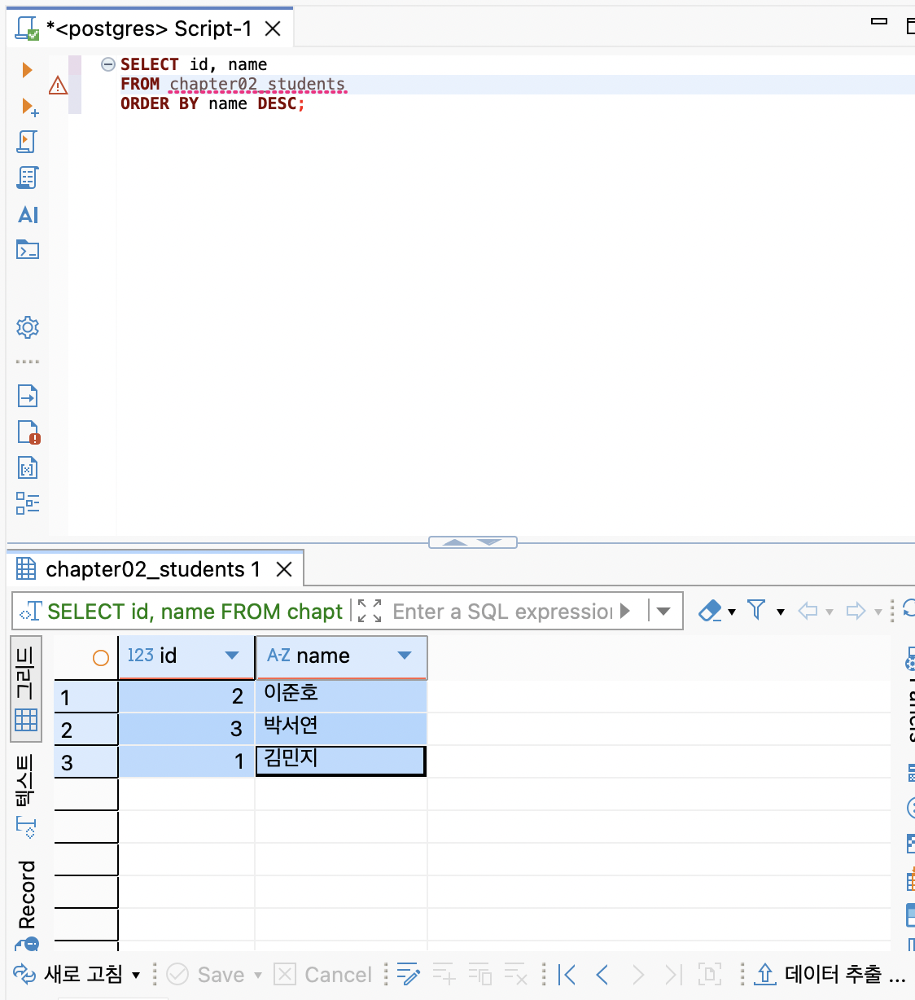
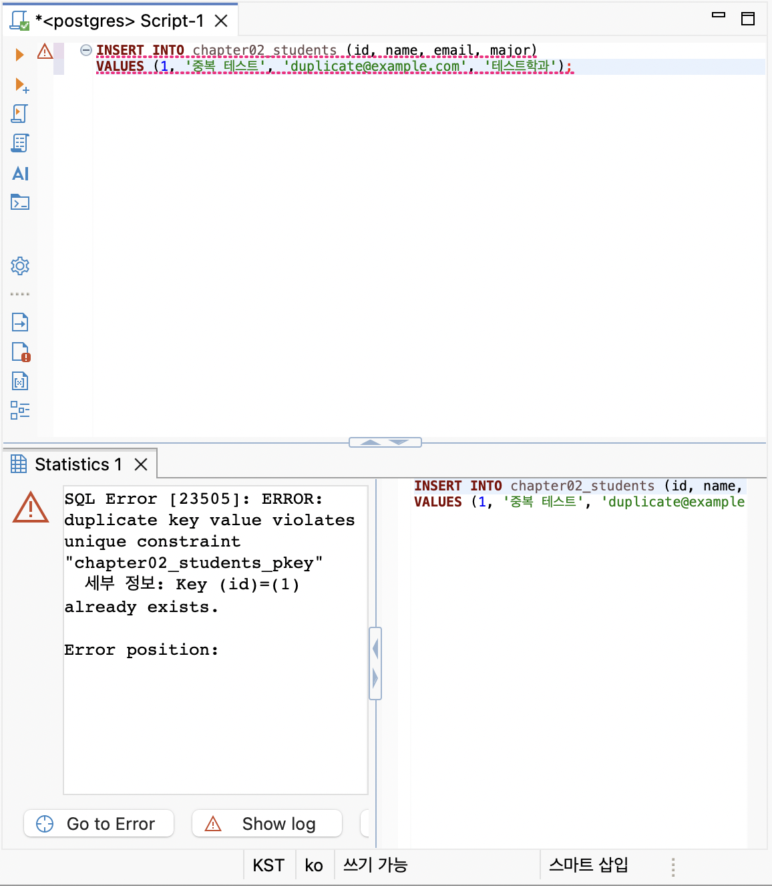
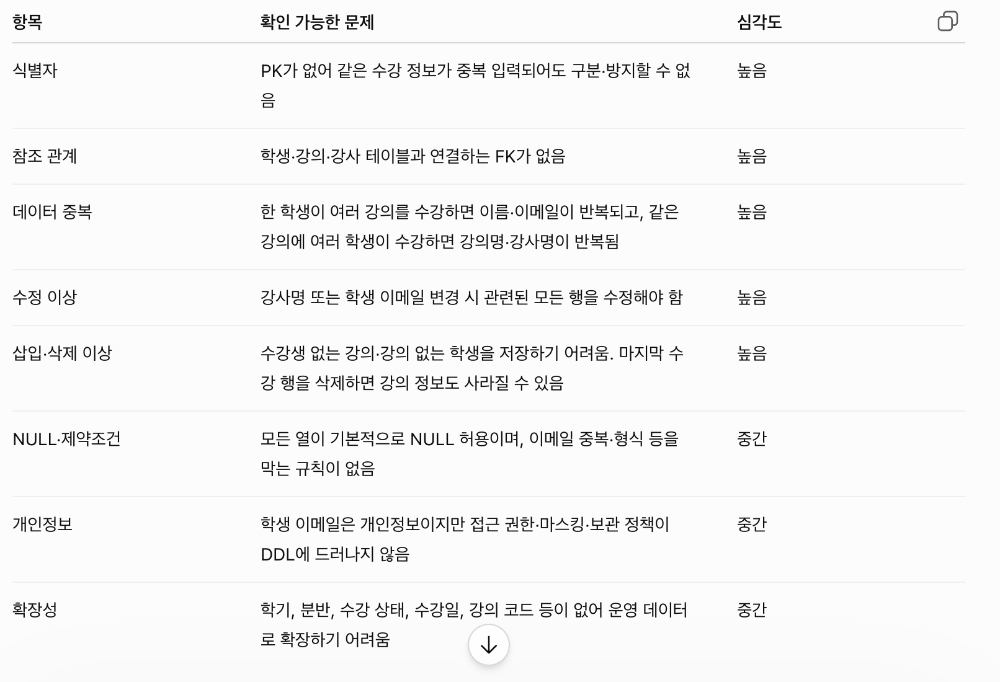

# Chapter 02 확장 실습 답안 템플릿

> **과제:** 데이터와 DBMS의 기본 개념  
> **사용 방법:** 이 파일을 내려받아 본인의 GitHub 저장소에 `chapter02_answer.md`라는 이름으로 저장한 뒤 실습하면서 바로 작성합니다.  
> **제출 방법:** LMS에는 파일을 직접 업로드하지 않고, **본인 GitHub 저장소의 `chapter02_answer.md` 파일 URL**을 제출합니다.

---

## 제출 전 개인정보 주의

LMS에서 제출자를 확인할 수 있으므로 이 공개 Markdown 파일에 학번이나 실명을 반드시 적을 필요는 없습니다.

```text
GitHub 계정 또는 별칭: gosaengchung
과제 작성일: 2026-09-15 
사용한 AI 도구:GPT 5.6 Terra
```

> 실제 비밀번호, API Key, 전체 DB 접속 URL, 개인정보가 포함된 화면은 올리지 않습니다.

---

# 1. PostgreSQL에서 현재 위치 확인

## 1-1. 실행한 SQL

```sql
SELECT version();
SELECT current_database();
SELECT current_user;
SELECT current_schema();
SHOW search_path;
```

## 1-2. 실행 결과 기록

```text
PostgreSQL 버전: PostgreSQL 18.6 on aarch64-apple-darwin24.6.0, compiled by Apple clang version 17.0.0 (clang-1700.0.13.5), 64-bit
현재 데이터베이스: postgres
현재 사용자: postgres
현재 스키마: public
search_path: public, "$user"
```

## 1-3. 구조를 내 말로 설명

```text
PostgreSQL은:
데이터를 저장하고 불러오는, 즉 관리하는 관계형 데이터베이스 소프트웨어입니다.

현재 접속한 데이터베이스는:
postgres입니다.

스키마는:
스키마는 데이터베이스 안에 만들어지는 공간으로 테이블 등을 묶어놓는 논리적 단계입니다. 스키마 안에 테이블이나 뷰 등이 만들어집니다. 현재 기본 스키마는 public입니다. 여기서 테이블을 생성하면 public.table_name 등으로 부를 수 있습니다. 

DBeaver 또는 psql 같은 도구는:
데이터베이스에 접속하여 SQL을 작성하고, 결과를 받아와 전시하는 프로그램입니다. DBeaver에서 작성한 SQL을 PostgrSQL로 전달하면 PostgreSQL이 실행합니다. 이 결과를 받아 DBeaver에서 결과를 내보냅니다.
```

## 1-4. 계층 구조 완성

```text
사용자
→ DBeaver 또는 psql
→ PostgreSQL DBMS
→ 데이터베이스
→ 스키마
→ 테이블
→ 행 / 열
```

## 1-5. 증거 화면

권장 경로:

```text
assignments/chapter02/images/step01_environment.png
```

```markdown

```

`여기에 STEP 1 핵심 증거 화면을 삽입하세요.`

---

# 2. 데이터베이스 안의 스키마와 테이블 관찰

## 2-1. 스키마 조회 결과

실행한 SQL:

```sql
SELECT schema_name
FROM information_schema.schemata
ORDER BY schema_name;
```

관찰한 스키마 이름 중 3개 이내를 적습니다.

```text
1.information_schema
2.pg_catalog
3.pg_temp_14
```

### `public`은 무엇인가요?

```text
나의 설명: public은 PostgreSQL에서 기본으로 제공하는 스키마입니다.
```

### 데이터베이스와 스키마는 같은 것인가요?

```text
나의 설명: 같지 않습니다. 위계상으론 데이터베이스 내에 스키마가 존재하고, 스키마는 데이터베이스 내에서 테이블 등을 구분하는 논리적 공간입니다.
```

## 2-2. 현재 보이는 테이블 조회

```sql
SELECT table_schema, table_name
FROM information_schema.tables
WHERE table_type = 'BASE TABLE'
  AND table_schema NOT IN ('pg_catalog', 'information_schema')
ORDER BY table_schema, table_name;
```

```text
조회된 사용자 테이블 수 또는 눈에 띈 테이블: 0개

아직 테이블이 거의 없어도 괜찮은 이유: 아직 스키마만 논리적으로 존재하는 것이지, 테이블은 만들어두지 않았기 떄문에 괜찮다.
```

## 2-3. 관찰 정리

```text
PostgreSQL 서버 안에는 여러 데이터베이스가 있을 수 있다.
한 데이터베이스 안에는 여러 스키마가 있을 수 있다.
스키마 안에는 테이블과 같은 데이터베이스 객체가 존재한다.
```

---

# 3. TEMP TABLE로 테이블·행·열·키 직접 확인

## 3-1. 임시 테이블 생성 완료 확인

- [o] `ch02_students` 생성
- [o] `ch02_courses` 생성
- [o] `ch02_enrollments` 생성

각 테이블의 **한 행 의미**를 적습니다.

| 테이블 | 한 행의 의미 |
| --- | --- |
| `ch02_students` | 학생 한 명의 정보 |
| `ch02_courses` | 수업 하나의 정보 |
| `ch02_enrollments` | 학생 한명이 수강한 수업 하나의 정보 |

## 3-2. 열의 의미 확인

### `ch02_students`

| 열 | 값의 의미 | 내부 식별자 / 업무 식별자 / 일반 속성 |
| --- | --- | --- |
| `id` | 학생을 식별하는 PK | 내부 식별자 |
| `student_number` | 학생에게 부여된 학번 | 업무 식별자 |
| `name` | 학생의 이름 | 일반 속성 |
| `major` | 학생의 전공 | 일반 속성 |

### `ch02_enrollments`

| 열 | 값의 의미 | PK / FK / 일반 속성 |
| --- | --- | --- |
| `id` | 저장된 수강신청 정보 하나 | PK |
| `student_id` | 수강신청한 학생의 ch02_students.id를 참조하는 값 | FK |
| `course_id` | 수강 과목의 식별자를 참조하는 값 | FK |
| `status` | 수강신청 상태 (Boolean) | 일반 속성 |

## 3-3. 입력된 행 수

```text
students 행 수: 0
courses 행 수: 0
enrollments 행 수: 0
```

## 3-4. 내부 식별자와 업무 식별자

```text
students.id가 필요한 이유: 테이블 안 row끼리를 안전히 분리하여 안정적으로 식별하기 위해 필요합니다.

student_number가 필요한 이유: 업무 상에서 쉽게 식별하기 위해 필요합니다.

둘을 항상 같은 값으로 사용하지 않아도 되는 이유: 학번 체계나 형식이 변경될 수 있으므로 내부 식별자와 분리해 관리하는 것이 안전합니다.
```

## 3-5. 숫자처럼 보이는 학번을 문자열로 저장한 이유

```text
나의 설명: 학번은 0으로 시작하거나 하이픈이 포함되는 등의 새로운 규칙이 적용될 수 있기 때문입니다.
```

---

# 4. 테이블과 조회 결과는 다르다

## 4-1. 원본 테이블 행 수

```text
ch02_students 전체 행 수: 3 (현재 테이블에 어떤 row를 넣어야하는지 어떤 기준으로 만들어야하는지가 강의자료에 없는 것 같아 김민지, 이준호, 박서연 데이터를 INSERT하여 만들었습니다.)
```

## 4-2. 일부 열만 조회

실행 SQL:

```sql
SELECT name, major
FROM ch02_students
ORDER BY id;
```

```text
원본 테이블의 열 수와 조회 결과의 열 수가 다른 이유: 본 테이블에는 id, student_number, name, major의 4개 열이 있지만, SELECT문에서 name과 major만 선택했기 때문에 조회 결과에는 2개 열만 나타납니다.
```

## 4-3. 조건을 적용한 조회

실행 SQL:

```sql
SELECT id, student_number, name, major
FROM ch02_students
WHERE major = '컴퓨터공학'
ORDER BY id;
```

```text
원본 테이블 행 수:3
조회 결과 행 수: 1
원본 테이블의 데이터가 삭제된 것인가?: 아닙니다.
그렇게 판단한 이유: WHERE에서 걸어준 조건절 때문에 컴퓨터공학이 major인 사람만 집계되기 때문입니다.
```

## 4-4. 정렬 결과 비교

```sql
SELECT id, name
FROM ch02_students
ORDER BY name ASC;

SELECT id, name
FROM ch02_students
ORDER BY name DESC;
```

```text
ASC 결과의 첫 학생: 김민지
DESC 결과의 첫 학생: 이준호

이 실험을 통해 ORDER BY에 대해 알게 된 점: ASC는 값을 오름차순으로, DESC는 내림차순으로 정렬합니다. 원본 테이블의 저장 순서를 바꾸는 것이 아니라 조회 결과의 표시 순서만 바꿉니다.
```

## 4-5. 증거 화면

권장 경로:

```text
assignments/chapter02/images/step04_result_set.png
```

`여기에 STEP 4 핵심 증거 화면을 삽입하세요.`

---

# 5. PK와 FK를 실제로 관찰

## 5-1. 정상 데이터의 관계 읽기

다음 SQL 결과를 보고 작성합니다.

```sql
SELECT
    e.id AS enrollment_id,
    s.name AS student_name,
    c.title AS course_title,
    e.status
FROM ch02_enrollments AS e
JOIN ch02_students AS s
    ON s.id = e.student_id
JOIN ch02_courses AS c
    ON c.id = e.course_id
ORDER BY e.id;
```

```text
한 행이 의미하는 것: 학생, 과목, 수강신청 테이블에 나뉘어 있는 정보를 수강신청 1건당 한 줄로 합쳐서 보여주는 조회입니다.

같은 student_id가 여러 enrollment 행에서 반복될 수 있는 이유: 한 학생이 여러 과목을 수강할 수 있기 때문입니다.

같은 course_id가 여러 enrollment 행에서 반복될 수 있는 이유: 한 과목이 여러 학생에 의해 수강될 수 있기 때문입니다.
```

## 5-2. 기본키 중복 오류 관찰

중복 PK 입력을 시도한 결과:

```text
실행 성공 / 실패: 실패 
오류 메시지에서 확인한 핵심 단어: duplicate key value violates unique constraint
왜 실패했다고 생각하는가:unique한 값이어야 할 PK에 중복된 값을 추가하려고 했기 때문입니다.
```

## 5-3. 존재하지 않는 학생을 참조하는 FK 오류 관찰

존재하지 않는 `student_id`를 사용한 수강신청 입력 결과:

```text
실행 성공 / 실패: 실패
오류 메시지에서 확인한 핵심 단어: violates foreign key constraint 
왜 실패했다고 생각하는가: FK의 경우 참조할 대상이 메인 테이블에 없으면 실패하기 떄문입니다.
```

## 5-4. PK와 FK의 차이 정리

```text
PK는 테이블의 각 행을 고유하게 식별하기 위한 키이다.
FK는 다른 테이블의 PK를 참조하여 테이블 간 관계를 연결하고 참조 무결성을 유지하기 위한 키이다.

FK 값이 여러 행에서 반복될 수 있는 이유는
한 학생이 여러 과목을 수강신청하듯이, 여러 행이 같은 하나의 부모 테이블 행을 참조할 수 있기 때문이다.
```

## 5-5. 증거 화면

권장 경로:

```text
assignments/chapter02/images/step05_pk_fk.png
```

> 오류 메시지는 전체 화면이 아니라 테이블명·constraint·참조 오류가 보이는 정도만 캡처합니다.

`여기에 STEP 5 핵심 증거 화면을 삽입하세요.`

---

# 6. 관계와 카디널리티를 자연어로 설명

현재 임시 데이터 기준으로 작성합니다.

```text
학생 한 명은 여러 수강신청을 가질 수 있는가?: 네

강의 한 개는 여러 수강신청을 가질 수 있는가?: 네

수강신청 한 건은 학생 몇 명을 참조하는가?: 1명을 참조합니다.

수강신청 한 건은 강의 몇 개를 참조하는가?: 1건을 참조합니다.
```

아래 구조를 완성합니다.

```text
students 1 ── N enrollments N ── 1 courses
```

### 학생과 강의가 N:M 관계라고 볼 수 있는 이유

```text
나의 설명: 한 학생은 여러 강의를 수강할 수 있고, 하나의 강의도 여러 학생이 수강할 수 있기 때문입니다. 따라서 학생과 강의는 직접 연결하면 N:M 관계가 됩니다.
```

> 아직 0개 허용 여부, 필수 관계, 삭제 정책까지 확정하지 않습니다. 그런 규칙은 Chapter 05~06에서 다룹니다.

---

# 7. AI가 만든 테이블 구조 직접 검토

## 7-1. AI에게 묻기 전에 내가 먼저 찾은 문제

다음 구조를 보고 최소 4개를 적습니다.

```sql
CREATE TABLE student_courses (
    student_name VARCHAR(50),
    student_email VARCHAR(100),
    course_title VARCHAR(100),
    instructor_name VARCHAR(50)
);
```

```text
문제 1. 적어도 한 개의 PK 지정이 없다. 
문제 2. PK로 될만한 컬럼이 없다 (INTEGER).
문제 3. student_course라는 테이블에 name, email, instructor_name 등이 포함되는 것은 저장소 낭비다.
문제 4. FK가 없어 입력된 학생·강의 정보가 실제로 존재하는지 보장할 수가 없다.
```

## 7-2. AI 검토 요청 프롬프트

사용한 핵심 프롬프트를 기록합니다.

```text
아래 데이터베이스 테이블 구조를 처음 검토하는 데이터 모델링 전문가의 관점에서 비판적으로 분석해 주세요.

CREATE TABLE student_courses (
    student_name VARCHAR(50),
    student_email VARCHAR(100),
    course_title VARCHAR(100),
    instructor_name VARCHAR(50)
);

다음 기준을 빠짐없이 점검해 주세요.

1. 각 테이블의 목적과 각 열이 표현하는 업무 의미
2. PK, 후보키, 업무 식별자, FK의 부재·오류·중복 가능성
3. 테이블 간 관계와 관계의 카디널리티(1:1, 1:N, N:M)
4. 데이터 중복, 함수 종속, 정규화 수준 및 정규화가 필요한 부분
5. 삽입·수정·삭제 이상이 발생할 수 있는 구체적 상황
6. NULL 허용 여부, 데이터 타입·길이, 기본값, UNIQUE·CHECK 제약조건의 적절성
7. 참조 무결성, 삭제·수정 시 연쇄 처리 정책, 중복 입력 위험
8. 개인정보·민감정보·권한 관리 측면의 위험
9. 조회 성능, 인덱스, 확장성, 변경 이력 관리 측면의 고려사항
10. 이름 규칙, 시간 정보, 상태값 관리 등 설계상 추가로 발견되는 문제

분석할 때는 다음 원칙을 지켜 주세요.
- DDL만으로 확정할 수 있는 사실과, 업무 규칙을 확인해야 하는 가정을 구분해 주세요.
- 근거 없이 “반드시 문제”라고 단정하지 말고, 확인이 필요한 질문도 제시해 주세요.
- 문제마다 왜 문제인지와 실제로 발생할 수 있는 작은 데이터 예시를 들어 주세요.
- 문제의 심각도를 높음·중간·낮음으로 표시해 주세요.

마지막에는 다음을 제공해 주세요.
1. 발견한 문제 요약 표
2. 업무 담당자에게 확인할 질문 목록
3. 개선된 ERD 수준의 테이블 관계
4. 개선된 테이블 구조(열, PK, FK, UNIQUE, NOT NULL, CHECK 포함)
5. PostgreSQL 기준의 예시 CREATE TABLE SQL
```

## 7-3. AI 제안과 나의 판단

| AI의 지적 또는 제안 | 동의 / 수정 / 보류 | 나의 근거 |
| --- | --- | --- |
| 한 학생이 여러 강의를 수강하면 이름·이메일이 반복 저장되고, 한 강의에 여러 학생이 수강하면 강의명·교수명이 반복 저장 | 보류 | 물론 중복 저장되는 것은 PK가 부재하는 상황에서 문제이지만, 만약 PK가 있다면 큰 문제로 볼 순 없음|
| 학생의 이메일이나 강의 담당 교수가 바뀌면 여러 행을 모두 수정해야 하며, 일부만 수정하면 데이터가 서로 달라질 수 있습니다. | 동의 | 데이터의 구분없이 한 테이블에 저장되어 있기 때문에 수정 및 삭제가 어렵다 |
| 아직 수강생이 없는 강의는 저장하기 어렵고, 마지막 수강신청 행을 삭제하면 강의·교수 정보도 함께 사라질 수 있습니다. | 동의 | 수강생이 없는 강의나 수강신청을 아직 하지 않은 학생은 전체 데이터베이스에 남을 수 없다 |
| 모든 열이 기본적으로 NULL 허용이며, 이메일 중복·형식 등을 막는 규칙이 없음 | 동의 |  |
| 학생·강의·강사 테이블과 연결하는 FK가 없음 | 동의 |  |

## 7-4. 본문과 대조한 항목

AI 설명 중 최소 하나를 `chapter02.md`와 비교합니다.

```text
AI가 설명한 내용: PK가 없어 같은 수강 정보가 중복 입력되어도 구분·방지할 수 없음

본문에서 확인한 내용: PK는 행을 구분하는 고유한 값이며, FK는 다른 테이블의 PK를 참조해 테이블 간 관계를 표현한다.

일치 / 부분 일치 / 수정 필요: 부분 일치

내가 최종적으로 이해한 내용: PK는 테이블의 각 행을 고유하게 식별하는 값이므로 중복될 수 없다. 따라서 수강신청처럼 여러 행이 저장되는 테이블에는 PK를 두어 각 행을 구분할 필요가 있다.
```

## 7-5. 증거 화면

권장 경로:

```text
assignments/chapter02/images/step07_ai_review.png
```

`여기에 AI 검토 과정의 핵심 화면을 삽입하세요.`

---

# 8. Chapter 01의 개인 서비스 아이디어를 DB 용어로 다시 표현

Chapter 01에서 정한 개인 서비스 주제를 그대로 사용하거나 새 주제를 정해도 됩니다.

## 8-1. 서비스 기본 정보

```text
서비스 이름: 실시간 방송 데이터 대시보드
서비스 목적: CHZZK의 실시간 방송 정보를 일정 주기로 수집하여 채널·카테고리·태그별 시청자 수와 참여 추이를 시계열로 분석하고 시각화하는 서비스입니다. 특정 시간대와 인기 콘텐츠의 시청 흐름을 파악하는 것을 목적으로 합니다.
```

## 8-2. PostgreSQL 구조 후보

```text
데이터베이스 이름 후보: chzzk_dashboard_db
스키마 이름 후보: analytics
```

> 아직 실제 데이터베이스나 스키마를 생성하지 않아도 됩니다.

## 8-3. 테이블 후보와 한 행 의미

최소 3개를 작성합니다.

| 테이블 후보 | 한 행의 의미 | 내부 ID 후보 | 업무 식별자 후보 |
| channels | 플랫폼의 채널 1개 | channel_id | platform_channel_name |
| broadcasts | 특정 채널의 방송 세션 1개 | broadcast_id | platform_live_name |
| tags | 방송에 사용되는 태그 1개 | tag_id | tag_name |
| broadcast_snapshots | 특정 방송을 특정 시점에 수집한 지표 1건 | snapshot_id | broadcast_id + captured_at |
| broadcast_tags | 특정 방송과 특정 태그의 연결 1건 | broadcast_tag_id | broadcast_id + tag_id |

## 8-4. FK 후보

```text
1. broadcasts.channel_id → channels.channel_id
   이유: 하나의 채널은 여러 방송을 진행할 수 있으므로, 각 방송이 어느 채널에서 진행되었는지 연결해야 합니다.

2. broadcast_snapshots.broadcast_id → broadcasts.broadcast_id
   이유: 시청자 수·채팅량 등 시점별 수치는 특정 방송에 속하므로, 어떤 방송을 측정한 값인지 연결해야 합니다.
```

## 8-5. 자연어 관계 문장

```text
1. 한 채널은 여러 방송을 진행할 수 있고, 하나의 방송은 하나의 채널에 속합니다.
2. 한 방송은 수집 시점마다 여러 개의 지표 스냅샷을 가질 수 있고, 하나의 스냅샷은 하나의 방송에 속합니다.
3. 한 방송에는 여러 태그가 연결될 수 있고, 하나의 태그도 여러 방송에 사용될 수 있으므로 broadcasts와 tags는 N:M 관계입니다.
```

## 8-6. 아직 확정하지 않을 정책

```text
Q1. 시청자 수와 채팅량을 몇 분 간격으로 수집할 것인가?
Q2. 방송이 종료된 뒤에도 시점별 원본 데이터를 얼마나 오래 보관할 것인가?
Q3. 태그가 방송 중간에 변경될 수 있을 때, 변경 시점까지 별도로 기록할 것인가?
```

---

# 9. AI를 개인 구조의 검토자로 사용

## 9-1. 사용한 프롬프트

```text
[사용한 프롬프트]

CHZZK 실시간 방송 데이터 대시보드를 설계하려고 합니다. 채널, 방송 세션, 방송 지표 스냅샷, 태그, 방송-태그 연결 테이블을 후보로 두었습니다.

방송 시청자 수와 채팅량은 일정 주기로 수집하며, 채널·카테고리·태그별 시간대 추이를 분석하려고 합니다.

각 테이블의 한 행 의미, PK와 업무 식별자, FK, N:M 관계, 데이터 중복 위험, 시계열 데이터 저장 방식, 아직 확정하면 안 되는 정책을 검토해 주세요. 업무 규칙을 임의로 가정하지 말고 확인 질문도 제시해 주세요.
```

## 9-2. AI가 질문한 내용 중 유용했던 것

```text
1. 지표 값을 broadcasts 테이블에 계속 덮어쓰지 말고, 수집 시점마다 broadcast_snapshots 행으로 저장할 것
2. 방송 태그는 하나의 방송에 여러 개가 붙을 수 있으므로 tags와 broadcast_tags로 분리할 것
3. 화면에 보이는 채널명은 변경될 수 있으므로, 플랫폼이 제공하는 채널 ID를 별도로 관리할 것
```

## 9-3. AI가 너무 빨리 결정한 내용 또는 내가 보류한 내용

```text
1. 방송 종료 후 데이터를 얼마나 보관할지는 서비스 목적과 저장 비용을 확인 필요
2. 채팅 메시지 원문까지 저장할지는 개인정보와 데이터 용량 문제 및 수집 방식에 대한 검토가 필요
3. 결국 기존의 대시보드들과 어떻게 차별화 및 구분될 수 있을지에 대한 고민이 필요
```

## 9-4. 검토 후 수정한 구조

| 수정 전 | 수정 후 | 수정 이유 |
| broadcasts에 현재 시청자 수를 저장 | broadcast_snapshots에 시점별 시청자 수를 저장 | 시간에 따른 변화 추이를 분석하기 위해서 |
| 방송 테이블에 태그명을 문자열로 직접 저장 | tags, broadcast_tags 테이블로 분리 | 여러 태그와 여러 방송의 N:M 관계를 표현하기 위해서 |
| 채널명을 채널 식별자로 사용 | 내부 channel_id와 platform_channel_id를 분리 | 채널명 변경과 중복 가능성에 대비하기 위해서 |

---

# 10. 최종 개념 정리

아래 문장을 본인의 말로 완성합니다.

```text
PostgreSQL은 데이터를 저장하고 불러오고 조회하는 데이터베이스 관리 시스템이다.

DBeaver 또는 psql은 sql을 실행하는 프로그램이 아닌 요청 및 결과를 전시하는 클라이언트이다.

데이터베이스와 스키마의 차이는 데이터베이스는 데이터를 독립적으로 관리하는 큰 단위이고, 스키마는 그 안에서 테이블과 같은 객체를 구분·관리하는 논리적 공간이다.

테이블 한 행은 테이블에서 정한 하나의 의미 있는 기록 단위이다.

조회 결과가 원본 테이블과 다른 이유는 SELECT문과 WHERE절 등의 조건에 의해 필요한 열과 행만 선택하거나 정렬해 보여 주기 때문이며, 원본 테이블 자체를 변경하지는 않기 때문이다.

내부 식별자와 업무 식별자의 차이는 내부 식별자는 시스템이 안정적으로 행을 구분하기 위한 값이고, 업무 식별자는 사용자가 실제 업무에서 활용하는 자연어라는 점이다.

PK는 UNIQUE하면서 NOT NULL한 키이다.

FK는 다른 테이블의 PK를 참조하여 테이블 간 관계를 연결하고 참조 무결성을 유지하는 키이다.
```

---

# 11. 이번 Chapter에서 새롭게 알게 된 점

최소 3개를 작성합니다.

```text
1. 데이터베이스 안에 스키마가 있고, 스키마 안에는 테이블·뷰·함수 등의 데이터베이스 객체가 존재한다는 점을 알게 되었다.
2. PostgreSQL과 DBeaver의 정확한 차이 및 위계를 알게 되었다.
3. DBeaver에서 새롭게 PostgreSQL을 실행하고 런타임을 유지하는 법을 알게 되었다.
```

## 아직 헷갈리는 내용

```text
1. 처음 터미널로 git을 키고 directory를 만든 다음 연결하는 법
2. 조회와 실제 데이터 테이블이 다르다면 이 조회성능을 늘리기 위해서 어떻게 데이터를 수집해야하는지
```

## AI에게 다시 질문하고 싶은 내용

```text
1. 실시간 방송 데이터처럼 일정 주기로 쌓이는 시계열 데이터에서, 중복 수집을 막으면서 조회 성능을 유지하려면 PK·UNIQUE 제약조건과 인덱스를 어떻게 설계해야 하는가?
2. 실시간 방송 데이터에서 비정형이나 반정형 데이터를 받게 된다면 이건 어떤 데이터베이스 환경에서 처리해야하는가? (특히 텍스트나 이미지 등)
```

---

# 12. 제출 전 자기 점검

- [x] PostgreSQL에서 현재 database / schema / search_path를 확인했다.
- [x] DBMS, database, schema, table을 구분해서 설명할 수 있다.
- [x] TEMP TABLE 3개를 생성하고 직접 데이터를 조회했다.
- [x] 각 테이블의 한 행 의미를 작성했다.
- [x] 테이블과 조회 결과가 다르다는 것을 실제 SQL로 확인했다.
- [x] `ORDER BY`를 사용하지 않으면 업무 순서를 가정하면 안 된다는 점을 이해했다.
- [x] 내부 식별자와 업무 식별자의 차이를 설명할 수 있다.
- [x] PK 중복 입력 실패를 직접 확인했다.
- [x] 존재하지 않는 FK 참조 실패를 직접 확인했다.
- [x] FK 값이 반복될 수 있는 이유를 설명할 수 있다.
- [x] AI가 만든 테이블을 내가 먼저 검토했다.
- [x] AI 설명 중 최소 하나를 본문과 대조했다.
- [x] 개인 서비스의 테이블 후보를 3개 이상 작성했다.
- [x] 개인 서비스의 FK 후보와 미확정 정책을 기록했다.
- [x] 실제 비밀번호·API Key·민감한 접속 정보가 포함되지 않았는지 확인했다.
- [x] 이미지 링크가 GitHub에서 정상적으로 보이는지 확인했다.

---

# 13. GitHub 제출 정보

답안 파일 권장 위치:

```text
assignments/chapter02/chapter02_answer.md
```

이미지 권장 위치:

```text
assignments/chapter02/images/
```

LMS 제출 URL 형식:

```text
https://github.com/gosaengchung/ai-database-study/blob/main/assignments/chapter02/chapter02_answer.md
```

## 최종 확인

- [x] 위 URL을 로그아웃 상태 또는 다른 브라우저에서 열어도 확인 가능하다.
- [x] Markdown이 정상 렌더링된다.
- [x] 이미지가 깨지지 않는다.
- [x] LMS에 교수자 템플릿 URL이 아니라 **내 답안 파일 URL**을 제출했다.
