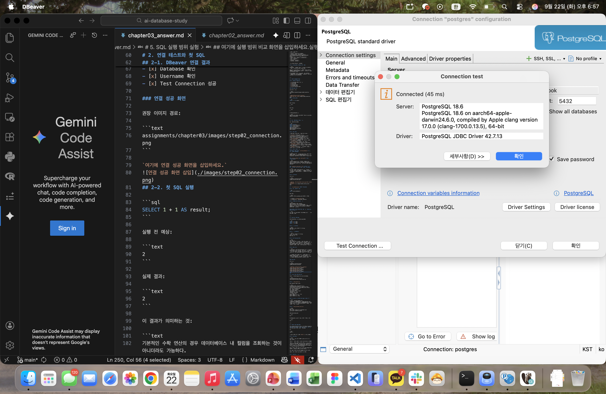
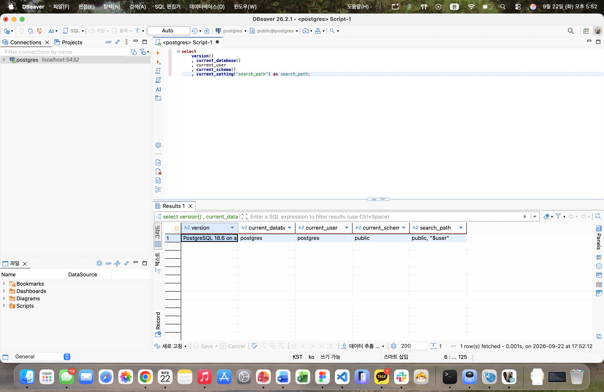
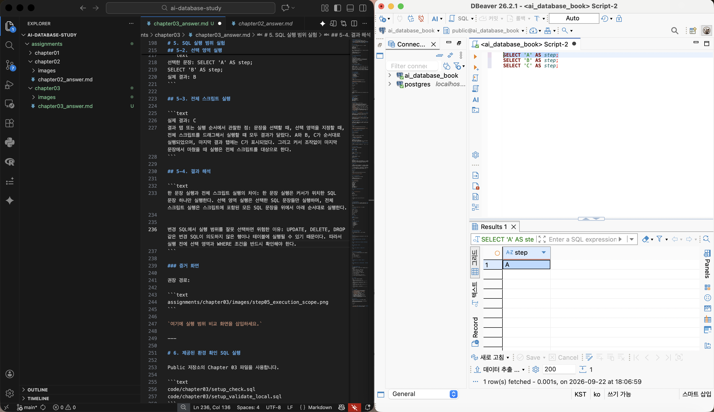
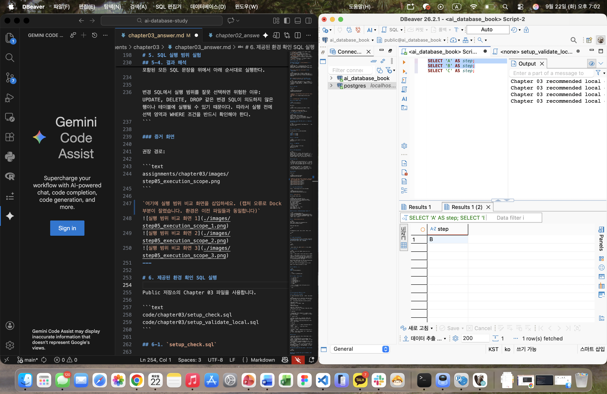
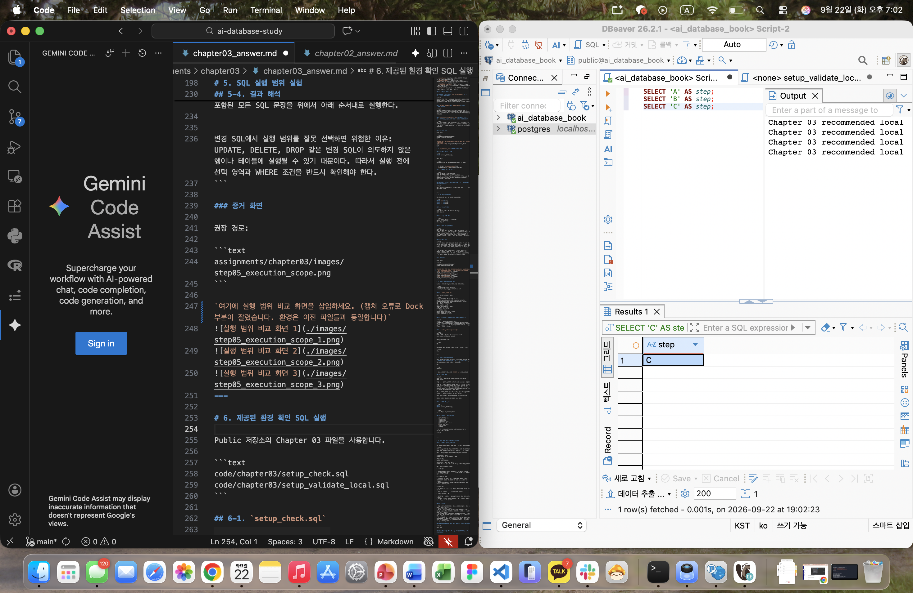

# Chapter 03 확장 실습 답안 템플릿

> **과제:** PostgreSQL과 DBeaver로 실습 환경 검증하기  
> **사용 방법:** 이 파일을 내려받아 본인의 GitHub 저장소에 `chapter03_answer.md`라는 이름으로 저장한 뒤 실습하면서 바로 작성합니다.  
> **제출 방법:** LMS에는 파일을 직접 업로드하지 않고, **본인 GitHub 저장소의 `chapter03_answer.md` 파일 URL**을 제출합니다.

---

## 제출 전 보안 주의

이 과제 파일과 캡처 화면에는 다음 정보를 올리지 않습니다.

```text
실제 PostgreSQL 비밀번호
전체 DB 접속 URL
API Key / Token
개인정보
공개할 필요가 없는 사내 서버 주소
```

LMS에서 제출자를 확인할 수 있으므로 공개 저장소의 답안 파일에 학번이나 실명을 반드시 적을 필요는 없습니다.

```text
GitHub 계정 또는 별칭: gosaengchung
과제 작성일: 2026-09-22
사용한 AI 도구: GPT 5.6 Terra
```

---

# 1. PostgreSQL과 DBeaver 환경 확인

## 1-1. 내 환경

| 항목 | 작성 내용 |
| --- | --- |
| 운영체제 | MacOS 26.5.1(25F80)|
| PostgreSQL 버전 | PostgreSQL 18.6 on aarch64-apple-darwin24.6.0, compiled by Apple clang version 17.0.0 (clang-1700.0.13.5), 64-bit |
| DBeaver 버전 | 버전26.2.1.202609210342 |
| Host | localhost |
| Port | 5432 |
| Database | postgres |
| Username | postgres |


> 비밀번호는 기록하지 않습니다.

## 1-2. PostgreSQL과 DBeaver 역할 설명

```text
PostgreSQL은: 데이터베이스 관리 시스템으로 데이터를 저장하고 쿼리문을 실행하는 시스템이다. 

DBeaver는: PostgreSQL과 같은 데이터베이스 시스템에 연결하여 요청문을 작성하여 전달하고, 그 결과를 받아오는 클라이언트 도구이다.

두 프로그램의 차이는: PostgreSQL은 실제 데이터를 저장·처리하는 서버 프로그램이고, DBeaver는 서버를 편리하게 사용하도록 돕는 프로그램이다.
```

---

# 2. 연결 테스트와 첫 SQL

## 2-1. DBeaver 연결 결과

- [x] PostgreSQL 연결 유형 선택
- [x] Host 확인
- [x] Port 확인
- [x] Database 확인
- [x] Username 확인
- [x] Test Connection 성공

### 연결 성공 화면

권장 이미지 경로:

```text
assignments/chapter03/images/step02_connection.png
```

`여기에 연결 성공 화면을 삽입하세요.`

## 2-2. 첫 SQL 실행

```sql
SELECT 1 + 1 AS result;
```

실행 전 예상:

```text
2
```

실제 결과:

```text
2
```

이 결과가 의미하는 것:

```text
기본적인 수학 연산의 경우 데이터베이스 내 컬럼을 조회하는 것이 아니더라도 가능하다.
```

---

# 3. 현재 연결 위치를 SQL로 검증

다음 SQL을 실행합니다.

```sql
SELECT version();
SELECT current_database();
SELECT current_user;
SELECT current_schema();
SHOW search_path;
SHOW transaction_read_only;
SHOW TimeZone;
```

## 3-1. 결과 기록

| 확인 항목 | 실제 결과 | 내가 이해한 의미 |
| --- | --- | --- |
| `version()` | PostgreSQL 18.6 on aarch64-apple-darwin24.6.0, compiled by Apple clang version 17.0.0 (clang-1700.0.13.5), 64-bit | 현재 PostgreSqL의 버전이 다음과 같음 |
| `current_database()` | postgres | 현재 위치한 데이터베이스 이름이 postgres이다. |
| `current_user` | postgres | 현재 데이터베이스의 소유자 이름이 postgres이다. |
| `current_schema()` | public | 현재 위치한 데이터베이스 내 스키마가 public이라는 스키마이다 |
| `search_path` | public, "$user" |  |
| `transaction_read_only` | off | 이 데이터베이스의 구조를 바꿀 수 있는 권한이 커져있다. (읽기 전용 모드가 off되어 있으므로) |
| `TimeZone` | Asia/Seoul | 지금 데이터베이스의 표준 시각이 서울 표준시를 따르고 있음 |

## 3-2. 반드시 설명할 것

### DBeaver 연결 이름과 `current_database()`는 왜 같은 개념이 아닌가요?

```text
DBeaver 연결 이름은 사용자가 DBeaver에서 임의로 붙인 접속 설정의 이름이고, current_database()는 현재 PostgreSQL 서버에 실제로 접속한 데이터베이스의 이름이다.
```

### `current_schema()`와 `search_path`는 어떤 관계가 있나요?

```text
current_schema()는 현재 테이블을 만들거나 찾을 때 기본으로 사용하는 스키마를 반환한다. 기본 스키마는 보통 search_path에서 실제로 사용할 수 있는 첫 번째 스키마와 연결된다.
```

### `transaction_read_only = off`라는 결과만으로 모든 테이블을 만들 권한이 있다고 단정할 수 있나요?

```text
현재 트랜잭션에서 쓰기 작업이 금지되지 않았다는 뜻일 뿐, 모든 테이블을 만들 권한이 있다는 뜻은 아니다. 테이블을 만들려면 대상 데이터베이스와 스키마에 대한 CREATE 권한이 별도로 필요하다.
```

## 3-3. 증거 화면

권장 경로:

```text
assignments/chapter03/images/step03_location_check.png
```

`여기에 현재 DB/사용자/스키마/search_path 결과 화면을 삽입하세요.`

---

# 4. `ai_database_book` 데이터베이스 확인

## 4-1. 현재 데이터베이스

```sql
SELECT current_database();
```

실제 결과:

```text
postgres (이후 ai_database_book CREATE 및 연결)
```

- [] 결과가 `ai_database_book`이다.
- [X] 다른 DB라면 올바른 연결로 전환했다.

## 4-2. 연결을 바꾼 뒤 다시 검증

```text
전환 전 데이터베이스: postgres
전환 후 데이터베이스: ai_databse_book
전환 여부를 판단한 근거: 새로운 데이터베이스 구축 후 SQL 편집기를 새로 만들어 current_database() 함수값을 확인했더니 변경되었다
```

### 화면에서 보이는 연결 이름만 믿지 않고 SQL을 다시 실행해야 하는 이유

```text
현재 SQL 창이 어느 데이터베이스 연결을 사용할지 지정되지 않은 상태이기 때문에
```

---

# 5. SQL 실행 범위 실험

SQL Editor에 다음 세 문장을 입력합니다.

```sql
SELECT 'A' AS step;
SELECT 'B' AS step;
SELECT 'C' AS step;
```

## 5-1. 한 문장 실행

```text
내가 실행한 문장: SELECT 'A' AS step;
실제 결과: A
```

## 5-2. 선택 영역 실행

```text
선택한 문장: SELECT 'A' AS step;
SELECT 'B' AS step;
실제 결과: B
```

## 5-3. 전체 스크립트 실행

```text
실제 결과: C
결과 탭 또는 실행 순서에서 관찰한 점: 문장을 선택할 때, 선택 영역을 지정할 때, 전체 스크립트를 드래그해서 실행할 떄 모두 결과가 달랐다. A와 B, C가 순서대로 실행되었으며, 마지막 결과 탭에는 C가 표시되었다. 그리고 커서 조작없이 마지막 문장에서 마쳤을 때 실행은 전체 스크립트를 대상으로 한다. 
```

## 5-4. 결과 해석

```text
한 문장 실행과 전체 스크립트 실행의 차이: 한 문장 실행은 커서가 위치한 SQL 문장 하나만 실행한다. 선택 영역 실행은 선택한 SQL 문장들만 실행하며, 전체 스크립트 실행은 스크립트에 포함된 모든 SQL 문장을 위에서 아래 순서대로 실행한다.


변경 SQL에서 실행 범위를 잘못 선택하면 위험한 이유: UPDATE, DELETE, DROP 같은 변경 SQL이 의도하지 않은 행이나 테이블에 실행될 수 있기 때문이다. 따라서 실행 전에 선택 영역과 WHERE 조건을 반드시 확인해야 한다.
```

### 증거 화면

권장 경로:

```text
assignments/chapter03/images/step05_execution_scope.png
```

`여기에 실행 범위 비교 화면을 삽입하세요.`



---

# 6. 제공된 환경 확인 SQL 실행

Public 저장소의 Chapter 03 파일을 사용합니다.

```text
code/chapter03/setup_check.sql
code/chapter03/setup_validate_local.sql
```

## 6-1. `setup_check.sql`

실행 결과에서 확인한 항목:

```text
PostgreSQL 버전: PostgreSQL 18.6 on aarch64-apple-darwin24.6.0, compiled by Apple clang version 17.0.0 (clang-1700.0.13.5), 64-bit
현재 DB: ai_database_book
현재 사용자: postgres
현재 스키마: public
search_path:public, "$user"
읽기 전용 여부: off
TimeZone: Asia/Seoul
1 + 1 결과: true
public 스키마 존재 여부: true
public USAGE 권한: true
public CREATE 권한: true
```

### 이 파일을 여러 번 실행해도 비교적 안전한 이유

```text
이 파일은 SELECT와 SHOW처럼 현재 서버·데이터베이스·스키마·권한 설정을 조회하는 명령만 포함하고 있으며, 테이블이나 데이터를 생성·수정·삭제하는 명령을 포함하지 않는다. 따라서 여러 번 실행해도 데이터베이스의 저장된 데이터나 구조는 변경되지 않는다.
```

## 6-2. `setup_validate_local.sql`

```text
실행 결과:
PASS / FAIL: Chapter 03 recommended local environment validation passed
```

실패했다면 실패 항목:

```text
없음
```

그 실패가 실제 문제인지 환경 차이인지 판단한 근거:

```text
없음
```

---

# 7. 안전한 오류 진단 실습

실제 오류가 있었다면 그 오류를 사용합니다. 오류가 없었다면 **데이터를 삭제하거나 서버를 강제로 중지하지 말고**, 안전한 SQL 문법 오류를 하나 만들어 관찰합니다.

예:

```sql
SELEC 1;
```

> 오류를 확인한 뒤 올바른 `SELECT 1;`로 복구합니다.

## 7-1. 오류 기록

```text
오류 메시지 핵심 문장: ERROR: syntax error at or near "SELEC"

내가 먼저 생각한 원인 1: select 문을 selec으로 오타냄

내가 먼저 생각한 원인 2: selec 문을 마지막으로 보냈더니, 앞의 select 문의 결과 이후, 다시 selec (오류가 있는 문장)의 결과로 덮어씌워지므로 오류가 생김 / 실제로 순서를 바꿔 selec / select 순서로 확인해보니 오류 없이 결과가 출력됨 (한 sql엔 select가 하나만 기능 가능)

실제로 확인한 방법: 오류 메시지에서 오류 위치가 SELEC임을 확인하고, SELECT로 수정한 뒤 다시 실행함

실제 원인: SELECT 예약어의 철자가 잘못되어 발생함

수정한 내용: SELEC 1;을 SELECT 1;로 수정
```

## 7-2. 수정 후 재검증

```sql
SELECT 1;
SELECT current_database();
```

```text
재검증 결과: ai_database_book
```

## 7-3. 오류를 유형으로 분류

- [ ] 서버 실행 문제
- [ ] Host 문제
- [ ] Port 문제
- [ ] Database 문제
- [ ] Username/인증 문제
- [x] SQL 문법 문제
- [ ] 권한 문제
- [ ] 기타

선택 이유: 오류문에서 selec 근처 syntax error를 발견하였기 때문이다.

```text

```

---

# 8. AI를 오류 분석 보조 도구로 사용

## 8-1. AI에게 전달한 프롬프트

비밀번호·개인정보·전체 접속 URL은 제거하고 기록합니다.

```text
너는 PostgreSQL SQL 코드 리뷰어이다. 아래 SQL을 실행하기 전에 문법 오류와 구조적·논리적 오류를 검토해 주세요.

환경은 PostgreSQL을 DBeaver에서 실행하는 상황이다.

[내가 의도한 작업]
여기에 SQL로 무엇을 하려는지 작성

[실행한 SQL]
여기에 SQL 붙여넣기

[오류 메시지 또는 실제 결과]
여기에 DBeaver 오류 메시지나 예상과 달랐던 결과 붙여넣기

다음 형식으로 답해 주세요.

1. 문법 오류

* 오류가 있다면 정확한 위치와 이유를 설명해 주세요.
* 마크다운 기호(`**`, `` ` `` 등)가 SQL에 섞여 있다면 따로 지적해 주세요.

2. 구조·논리 오류

* 테이블명, 열 이름, 별칭, JOIN 조건, PK·FK, NULL, WHERE 조건, GROUP BY, ORDER BY 등의 문제를 점검해 주세요.
* 실제로 확인 가능한 문제와 추가 정보가 있어야 판단할 수 있는 문제를 구분해 주세요.

3. 수정 SQL

* 내 의도를 최대한 유지한 완전한 PostgreSQL SQL을 제시해 주세요.
* 수정한 부분에는 짧은 주석을 달아 주세요.

4. 실행 전 확인할 점

* 데이터가 변경·삭제될 가능성이 있으면 위험 요소를 알려 주세요.
* 정보가 부족하면 임의로 가정하지 말고, 확인이 필요한 질문을 최대 5개만 제시해 주세요.
```

## 8-2. AI 답변 검토

| AI가 제안한 확인 방법 | 실제로 확인했는가? | 결과 | 수용 / 수정 / 거절 |
| --- | --- | --- | --- |
| SELEC은 PostgreSQL의 SQL 예약어가 아니므로 문법 오류가 발생합니다. SELECT로 수정해야 합니다. | O | 실제 오류 맞음 | 수용 |
| 테이블·데이터를 생성하거나 수정·삭제하는 SQL은 포함하지 않아 환경 점검용 스크립트로 적절합니다. | O | 실제 문제 없음 | 수용 |
| 마지막 SELEC 1;은 앞의 검증 블록과 별개의 의도적 문법 오류입니다. 이 줄을 그대로 두면 앞의 환경 검증이 통과했더라도 전체 스크립트 실행은 마지막에 실패합니다. | O | 실제 검증으로 확인 | 수용 |

### AI가 오류 원인을 너무 빨리 단정한 부분이 있었나요?

```text
딱히 없다
```

### 오류 메시지와 실제 환경 중 무엇을 확인해서 최종 판단했나요?

```text
오류 메시지에서 82번째 줄의 SELEC이 문법 오류 원인임을 확인했고, 실제 환경에서는 Chapter 03 recommended local environment validation passed 메시지가 출력된 것을 확인했다. 따라서 PostgreSQL 환경 설정은 정상이며, 최종 오류는 환경 문제가 아니라 SQL 예약어 오타라고 판단했다.
```

### AI 활용에서 가장 유용했던 점

```text
긴 SQL 스크립트에서 오류가 난 정확한 위치와 원인을 빠르게 찾고, 문법 오류와 환경 설정 문제를 구분했다.
```

### AI 답변을 그대로 실행하지 않고 확인해야 하는 이유

```text
AI는 실제 데이터베이스 구조, 연결 대상, 권한, 데이터 상태를 직접 알 수 없으므로 제안한 SQL이 현재 환경에 맞지 않을 수 있다.
```

---

# 9. Chapter 01~02 개인 서비스와 연결

앞에서 선택한 개인 서비스가 PostgreSQL을 사용한다고 가정합니다.

```text
서비스 이름: CHZZK 실시간 방송 데이터 대시보드

사용할 데이터베이스 이름 후보: chzzk_dashboard_db

사용할 스키마 이름 후보: analytics

앞으로 만들고 싶은 테이블 후보 3개:
1. channels: CHZZK 채널의 기본 정보와 플랫폼 채널 식별자를 저장하는 테이블
2. broadcasts: 특정 채널에서 진행된 방송 세션 정보를 저장하는 테이블
3. broadcast_snapshots: 특정 방송의 시청자 수, 채팅량 등 지표를 특정 수집 시점별로 저장하는 테이블
```

### 아직 SQL을 만들지 않고 이름과 역할만 정하는 이유

```text
테이블을 만들기 전에 각 테이블이 어떤 대상을 저장하는지와 한 행의 의미를 먼저 정해야 한다. 특히 실시간 방송 데이터는 수집 주기와 보관 기간, 태그 변경 여부에 따라 필요한 열과 관계가 달라질 수 있으므로 업무 규칙을 확인한 뒤 SQL 구조를 설계하는 것이 안전하다.
```

### Chapter 02에서 정리했던 한 행의 의미 중 수정할 부분이 있나요?

```text
방송 데이터에서는 broadcast_snapshots 테이블의 한 행 의미를 더 구체적으로 정할 필요가 있다. 한 행은 단순히 방송 하나가 아니라, 특정 방송의 시청자 수와 채팅량을 특정 시점에 수집한 지표 1건을 의미해야 한다.
```

---

# 10. 초보자용 연결 가이드 작성

친구가 자신의 PC에서 같은 실습을 시작한다고 가정합니다. 아래 순서를 자신의 말로 작성합니다.

```text
1. PostgreSQL 서버가 실행되는지 확인하는 방법: DBeaver 환경에서 test connection을 통해 connected 메세지가 출력되는지를 확인한다.

2. DBeaver에서 PostgreSQL 연결을 만드는 방법: DBeaver에서 새 데이터베이스 연결을 선택한 뒤 PostgreSQL을 고르고, Host, Post, Database, Password 등을 입력한다. Test Connection으로 연결을 확인한 후 저장한다.

3. Host / Port / Database / Username의 의미: Host는 PostgreSQL 서버가 실행 중인 컴퓨터 로컬 주소이고, Port는 PostgreSQL 서버에 접속하기 위한 통신 번호이다. Database는 접속한 데이터베이스의 이름이며, Username은 데이터베이스를 사용하는 사용자 계정의 이름이다.

4. ai_database_book에 연결되었는지 확인하는 방법: SELECT current_database();를 실행하여 결과가 ai_database_book인지 확인한다.

5. 현재 위치를 확인하는 SQL: SELECT current_database(), current_user, current_schema(), current_setting('search_path');를 실행한다.

6. 한 문장과 전체 스크립트 실행을 구분해야 하는 이유: 지정 범위에 따라 SQL 실행 범위가 다르기 때문이다. 

7. 비밀번호를 GitHub나 AI 프롬프트에 넣으면 안 되는 이유: 다른 사람에게 노출될 경우 데이터베이스에 무단으로 접속하여 데이터를 변경하는 등 악용될 수 있다.
```

---

# 11. 최종 성찰

아래 문장은 반드시 본인의 말로 작성합니다.

```text
1. DBeaver와 PostgreSQL의 가장 중요한 차이는 보조 도구와 실제 저장/관리 하는 시스템으로 구분된다는 점이다. 특히, DBeaver의 경우 단독으로 SQL을 실행할 수 없고 반드시 서버의 연결이 필요하다.

2. 내가 지금 어느 데이터베이스에 연결되어 있는지 확인할 때
   화면 이름만 보지 않고 current_database() 함수를 실행해야 한다.

3. PostgreSQL 오류가 발생했을 때 가장 먼저 해야 할 일은 오류 메시지의 핵심 문장 과 오류가 발생한 SQL 위치를 확인하는 것이다.

4. AI를 오류 해결에 사용할 때 가장 중요한 것은 AI의 답변을 그대로 맹신하지 않고, 실제 검증을 통해 확인하는 것이다.
```

---

# 12. 제출 체크리스트

- [x] `chapter03_answer.md`의 빈 필수 항목을 작성했다.
- [x] PostgreSQL과 DBeaver의 역할 차이를 설명했다.
- [x] `current_database/current_user/current_schema/search_path`를 실제로 확인했다.
- [x] `ai_database_book` 연결 여부를 SQL로 검증했다.
- [x] SQL 실행 범위 세 가지를 비교했다.
- [x] `setup_check.sql`을 실행했다.
- [x] `setup_validate_local.sql` 결과를 확인했다.
- [x] 오류 원인을 먼저 스스로 추정한 뒤 AI를 사용했다.
- [x] AI 제안을 실제 환경에서 검증했다.
- [x] 핵심 캡처 3~4장만 골라 넣었다.
- [x] 캡처에 비밀번호·개인정보·전체 접속 URL이 없다.
- [x] Markdown 이미지가 GitHub 웹 화면에서 실제로 보인다.
- [x] 최종 답안 파일을 commit/push했다.

---

# 13. LMS 제출 URL

아래 형식의 **본인 GitHub 파일 URL**을 LMS에 제출합니다.

```text
https://github.com/<본인-GitHub-ID>/<본인-저장소>/blob/main/assignments/chapter03/chapter03_answer.md
```

내 제출 URL:

```text
https://github.com/gosaengchung/ai-database-study/blob/main/assignments/chapter03/chapter03_answer.md
```

> 저장소 메인 URL, 교수자 템플릿 URL, Raw URL이 아니라 **작성 완료된 본인 `chapter03_answer.md` 파일 화면 URL**을 제출합니다.