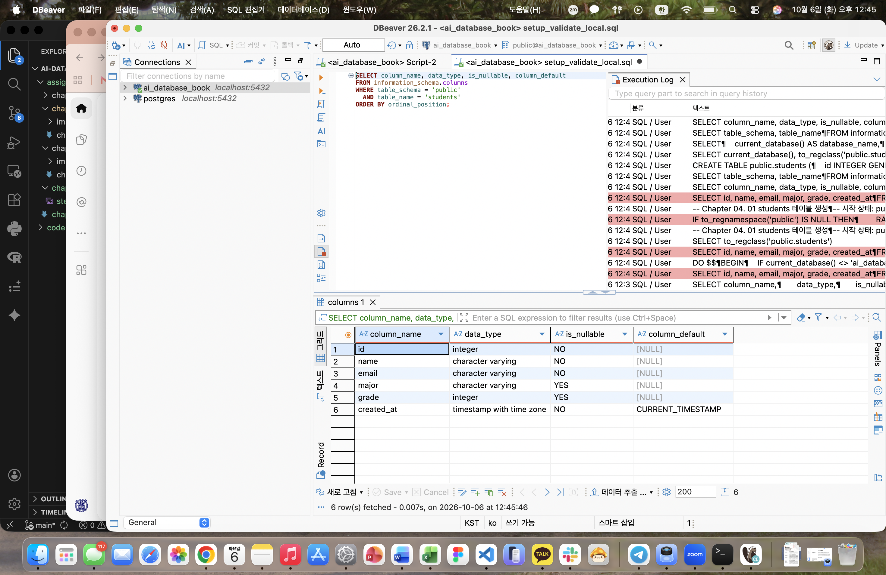
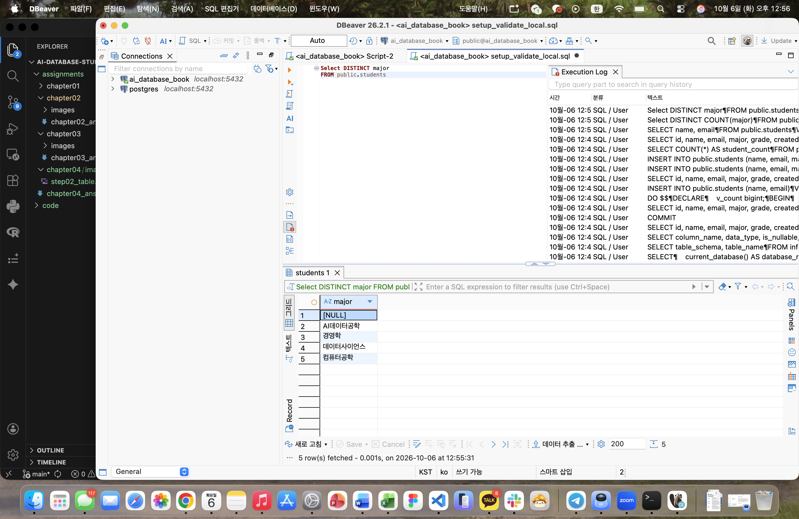
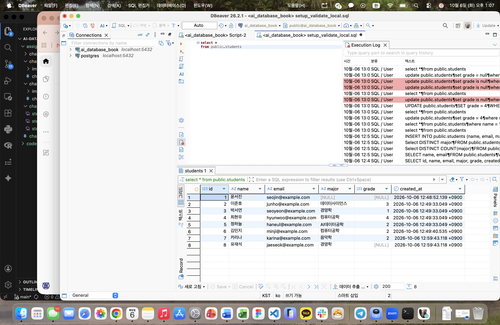
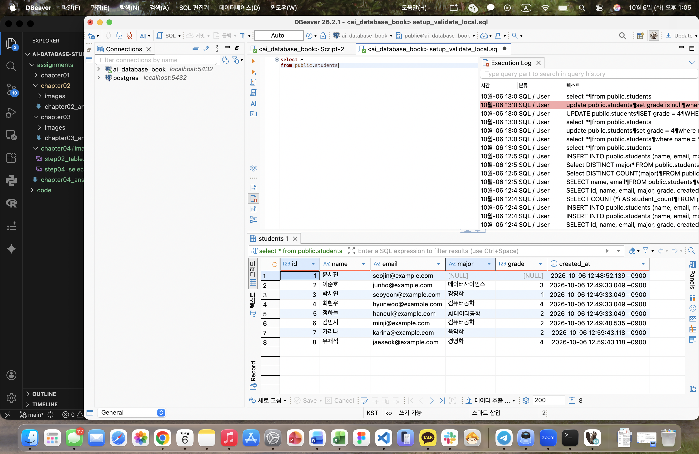

# Chapter 04 확장 실습 답안 템플릿

> **과제:** 관계형 데이터베이스와 SQL 시작하기  
> **사용 방법:** 이 파일을 내려받아 본인의 GitHub 저장소에 `chapter04_answer.md`라는 이름으로 저장한 뒤 실습하면서 바로 작성합니다.  
> **제출 방법:** LMS에는 파일을 직접 업로드하지 않고, **본인 GitHub 저장소의 `chapter04_answer.md` 파일 URL**을 제출합니다.

---

## 제출 전 주의

이 파일과 캡처 화면에는 실제 비밀번호, 전체 DB 접속 URL, API Key, 개인정보를 기록하지 않습니다.

```text
GitHub 계정 또는 별칭: gosaengchung
과제 작성일: 2026-10-16
사용한 AI 도구: GPT 5.6 Terra
```

---

# 1. 실습 환경과 시작 상태 확인

다음을 실행합니다.

```sql
SELECT current_database();
SELECT current_user;
SELECT current_schema();
SHOW search_path;
SHOW transaction_read_only;
```

| 확인 항목 | 실제 결과 | 의미 |
| --- | --- | --- |
| current_database() | ai_database_book | 현재 위치한 데이터베이스의 이름 |
| current_user | postgres | 현재 데이터베이스의 소유자 이름이 postgres |
| current_schema() | public | 현재 위치한 데이터베이스 내 스키마가 public이라는 스키마 |
| search_path | public, "$user" | 어느 스키마부터 순서대로 찾아볼지 결정, 현재 접속한 사용자 이름과 같은 이름의 스키마 ($user)의 public 스키마 |
| transaction_read_only | off | 이 데이터베이스의 구조를 바꿀 수 있는 권한이 커져있다. (읽기 전용 모드가 off되어 있으므로) |

- [x] 현재 DB가 `ai_database_book`이다.
- [x] 변경 가능한 연결인지 확인했다.
- [x] 실행할 SQL 범위를 확인했다.
- [x] Auto-commit 상태를 확인했다.

### 변경 SQL을 실행하기 전에 현재 DB와 실행 범위를 확인해야 하는 이유

```text
변경 SQL은 데이터를 추가·수정·삭제할 수 있으므로, 실행 전에 현재 연결된 DB가 맞는지와 쿼리가 영향을 미칠 범위가 어디까지인지 확인해야 함
```

---

# 2. `public.students` 구조 생성

## 2-1. 실행 전 예상

```text
테이블 이름: public.students
한 행의 의미: 학생 한 명의 정보 (이름, 이메일 등)
예상 행 수: 0행
기본키: id
필수 열: name, email, created_at
중복을 막는 열: email
자동 생성 열: id, created_at
```

## 2-2. 실행 파일

```text
code/chapter04/01_create_students.sql
```

## 2-3. 실행 후 확인

```text
테이블 생성 성공 여부: 생성 성공
실제 행 수: 0
DBeaver에서 확인한 위치: ai-database의 public 스키마
```

### 각 열의 역할

| 열 | 타입 | NULL 가능? | 역할 |
| --- | --- | --- | --- |
| id | `INTEGER` | 아니요 | 기본키, 자동으로 증가하는 고유 ID |
| name | `VARCHAR(50)` | 아니요 | 학생 이름 |
| email | `VARCHAR(100)` | 아니요 | 학생 이메일, 중복 불가 |
| major | `VARCHAR(100)` | 예 | 전공 |
| grade | `INTEGER` | 예 | 학년 |
| created_at | `TIMESTAMPTZ` | 아니요 | 생성 시각, 기본값은 현재 시각 |

### `id`를 학번이나 학생 수로 해석하면 안 되는 이유

```text
여기서의 id는 데이터베이스 상에서 식별하기 위한 임의의 값이고 실제 업무 상에 사용하는 의미가 아님
```

### 증거 화면

권장 경로:

```text
assignments/chapter04/images/step02_table.png
```



---

# 3. 샘플 데이터 6명 입력

## 3-1. 실행 전 예상

```text
현재 행 수: 0행
실행 후 예상 행 수: 6행
예상되는 NULL 포함 학생: 윤서진 (전공와 성적이 비어있음)
```

## 3-2. 실행 파일

```text
code/chapter04/02_insert_students.sql
```

## 3-3. 실제 결과

```text
실제 행 수: 6행
이준호 grade: 3
박서연 존재 여부: 있음
윤서진 major: NULL
윤서진 grade: NULL
```

### 예상과 실제 비교

```text
예상과 실제가 일치했는가: 일치함
다르다면 이유:
```

### `created_at` 값이 여러 행에서 같을 수 있는 이유

```text
각 행을 넣는 순간의 시각이 아니라, 현재 트랜잭션이 시작된 시각 자체를 반환하기 때문에 같은 작업 내에서 추가된 행은 같은 타임스탬프 시간을 공유할 것이다
```

---

# 4. SELECT 복습과 결과 검증

각 문제는 **SQL 실행 전에 예상 행 수를 먼저 작성**합니다.

| 번호 | 조회 문제 | 예상 행 수 | 실제 행 수 | 일치? | 다르면 이유 |
| ---: | --- | ---: | ---: | --- | --- |
| 1 | 전체 학생 | 6 | 6 | 일치 |  |
| 2 | 이름·이메일만 조회 | 6 | 6 | 일치 |  |
| 3 | 컴퓨터공학 전공 | 2 | 2 | 일치 |  |
| 4 | 3학년 이상 | 2 | 2 | 일치 |  |
| 5 | 컴퓨터공학 혹은 데이터사이언스 중 하나 | 3 | 3 | 일치 |  |
| 6 | `grade IS NULL` | 1 | 1 | 일치 |  |
| 7 | 전공 `DISTINCT` | 4 | 5 | 불일치 | NULL이 포함되어 있어서 |
| 8 | 정렬 후 상위 3명 | 3 | 3 | 일치 |  |

## 4-1. 내가 직접 작성한 SQL 2개

```sql
-- SQL 1
SELECT name, email
FROM public.students
WHERE major IN ('데이터사이언스', '컴퓨터공학');
```

```text
이 SQL의 한 행 의미: 전공이 데이터사이언스 또는 컴퓨터공학인 학생들의 이름과 이메일
예상 행 수: 3행
실제 행 수: 3행
```

```sql
-- SQL 2
Select DISTINCT COUNT(major)
FROM public.students
```

```text
이 SQL의 한 행 의미: 전공 종류의 개수 (NULL 포함)
예상 행 수: 4
실제 행 수: 5
```

## 4-2. `= NULL` 대신 `IS NULL`을 사용하는 이유

```text
NULL은 값이 없거나 정해지지 않았다는 뜻이라 일반적으로 수를 비교하는 연산자 `=`로 비교할 수 없음
```

## 4-3. `ORDER BY` 없이 결과 순서를 믿으면 안 되는 이유

```text
ORDER BY가 없으면 데이터베이스가 결과를 어떤 순서로 보여줄지 보장하지 않음
```

## 4-4. `DISTINCT`가 원본 데이터를 삭제하는 기능인가요?

```text
아니다. DISTINCT는 원본 데이터를 삭제하거나 추가하는 기능이 아닌 select를 통한 불러오기 기능에 속함
```

### 증거 화면

권장 경로:

```text
assignments/chapter04/images/step04_select.png
```


---

# 5. 내 가상 학생 2명 추가

실명·실제 이메일 대신 가상 데이터를 사용합니다.

## 5-1. 실행 전 계획

```text
학생 A
이름: 카리나
이메일: karina@example.com
전공: 음악학
학년: 2

학생 B
이름: 유재석
이메일: jaeseok@example.com
전공: 경영학
학년 또는 NULL: NULL

현재 행 수: 6행
추가 후 예상 행 수: 8행
```

## 5-2. 내가 실행한 INSERT

```sql
INSERT INTO public.students (name, email, major, grade)
VALUES
    ('카리나', 'karina@example.com', '음악학', 2),
    ('유재석', 'jaeseok@example.com', '경영학', NULL);
```

## 5-3. 실제 결과

```text
RETURNING 또는 확인 SELECT 결과: 정상적으로 추가됨
실제 전체 행 수: 8행
예상과 일치 여부: 일치함
```

### 내가 일부 값을 NULL로 둔 이유 또는 NULL을 사용하지 않은 이유

```text
입학 전의 인원이나 휴학 중 내지 제적 중인 인원임을 가정 
```

---

# 6. 안전한 UPDATE

내가 추가한 가상 학생 한 명만 수정합니다.

## 6-1. 먼저 대상 확인 SELECT

```sql
select *
from public.students
where name = '유재석'
```

```text
예상 대상 행 수: 1
실제 대상 행 수: 1
```

## 6-2. UPDATE

```sql
update public.students
set grade = 4
where name = '유재석'
```

```text
예상 영향 행 수: 1행
실제 영향 행 수: 1행
RETURNING 결과: RETURNING name, garde: '유재석', 4
```

## 6-3. UPDATE 후 재조회

```sql
select *
from public.students
where name = '유재석'
```

### `WHERE` 없는 UPDATE를 실행하면 위험한 이유

```text
조건을 걸어주지 않으면 모든 행의 해당 컬럼 값이 바뀌게 된다
```

### 증거 화면

권장 경로:

```text
assignments/chapter04/images/step06_update.png
```



---

# 7. 안전한 DELETE

내가 추가한 가상 학생 한 명을 삭제합니다.

## 7-1. 삭제 전 확인

```sql
select *
from public.students
WHERE email = 'karina@example.com';
```

```text
예상 대상 행 수: 1
실제 대상 행 수: 1
```

## 7-2. DELETE

```sql
DELETE FROM public.students
WHERE email = 'karina@example.com'
RETURNING id, name, email;
```

```text
예상 영향 행 수: 1
실제 영향 행 수: 1
RETURNING 결과: 7	카리나	karina@example.com
```

## 7-3. 삭제 후 재조회

```sql
select *
from public.students
WHERE email = 'karina@example.com';
```

```text
삭제 후 같은 조건의 SELECT 결과 행 수: 0
```

### `DELETE` 성공 메시지만 보고 끝내지 않고 다시 SELECT해야 하는 이유

```text
성공 메시지는 쿼리가 실행됐다는 것을 알려줄 뿐, 실제 의도대로 삭제되었는지 확인이 되지 않음
```

---

# 8. 본문 기준 UPDATE·DELETE 상태 검증

`04_update_delete_students.sql`을 본문 시작 상태에서 실행했다면 다음을 확인합니다.

```text
최종 학생 수: 7
이준호 grade: 3
박서연 존재 여부: 존재함
```

본문 기준 기대 상태와 비교합니다.

```text
학생 수 = 5
이준호 grade = 4
박서연 = 0행
```

### 내 실제 결과가 기준과 다르다면 원인

```text
본문 기준으론 6명으로 시작하였으나 실습에서 추가된 카리나 학생때문에 ‘학생 수가 6명이어야 한다’는 초기 상태 검사를 통과하지 못함
```

---

# 9. 의도한 실패 2개 관찰

> 실패 테스트는 데이터베이스 규칙이 실제로 데이터를 보호하는지 확인하는 실험입니다.

## 9-1. 중복 이메일 `UNIQUE` 오류

내가 사용한 SQL:

```sql
INSERT INTO public.students (name, email)
VALUES ('민지2', 'minji@example.com');
```

```text
오류 메시지 핵심 단서: violates unique constraint "students_email_key"
왜 실패해야 맞는가: minji@example.com을 사용하는 학생이 이미 있기 때문
어떤 규칙이 작동했는가: email 열의 UNIQUE 제약 조건
실패 후 기존 데이터가 어떻게 유지되었는가: 기존 학생 정보는 그대로이고 중복 테스트 행은 추가되지 않음
```

## 9-2. 이름 `NULL` 입력 `NOT NULL` 오류

내가 사용한 SQL:

```sql
INSERT INTO public.students (name, email)
VALUES (NULL, 'null@example.com');
```

```text
오류 메시지 핵심 단서: column "name" of relation "students" violates not-null constraint
왜 실패해야 맞는가: name은 필수 입력 열인데 NULL을 입력했기 때문
어떤 규칙이 작동했는가: name 열의 NOT NULL 제약 조건
```

### 실패한 INSERT 뒤 자동 생성 `id` 번호에 빈 구간이 생길 수 있어도 문제라고 단정할 수 없는 이유

```text
자동 생성 id는 시퀀스에서 번호를 가져온다. 따라서 INSERT가 실패해도 이미 사용한 시퀀스 번호가 되돌아가지 않을 수 있어 id에 빈 공백이 생길 수 있다.
```

### 증거 화면

권장 경로:

```text
assignments/chapter04/images/step09_constraint_error.png
```


---

# 10. `verify_students.sql`로 최종 상태 확인

실행 파일:

```text
code/chapter04/verify_students.sql
```

```text
현재 전체 학생 수: 7
NULL 개수: 3
이준호 grade: 3
박서연 존재 여부: 존재함
현재 데이터 상태에서 예상과 다른 부분: 03.delete 문서가 적용되지 않음
```

### 검증 SQL을 따로 두면 좋은 이유

```text
변경 작업을 실행한 뒤 검증 SQL로 현재 데이터 상태를 다시 확인할 수 있고, 원인을 찾기 용이함
```

---

# 11. AI를 SQL 작성자가 아니라 검토자로 활용

먼저 본인이 SQL을 작성한 뒤 AI에게 검토를 요청합니다.

## 11-1. 내가 작성한 SQL

```sql
UPDATE public.students
SET grade = grade + 1
WHERE major = '컴퓨터공학'
  AND grade IN (1, 2)
RETURNING id, name, major, grade;
```

## 11-2. AI에게 전달한 핵심 요청

```text
이 SQL을 대신 작성하지 말고 검토해줘.
현재 테이블 구조와 샘플 데이터를 기준으로 어떤 행이 수정되는지, 예상 영향 행 수가 몇 개인지 확인해줘.
NULL이나 조건 누락으로 예상하지 않은 학생까지 수정될 가능성이 있는지도 알려줘.
실행 전에 확인할 SELECT와 실행 후 검증 방법도 제안해줘.
```

## 11-3. AI 검토 결과

| AI 제안 | 수용 / 수정 / 거절 | 실제 검증 결과 | 나의 이유 |
| --- | --- | --- | --- |
| UPDATE 전에 같은 조건으로 SELECT해 대상 학생을 확인 | 수용 | 실행 전 조회 결과에서 컴퓨터공학 전공 2학년 학생 1명 확인 | 수정 대상이 의도와 맞는지 먼저 볼 수 있어서 |
| `grade IN (1, 2)` 조건이 다른 학년을 제외하는지 확인 | 수용 | 1·2학년만 조회 조건에 포함됨 | 3·4학년 학생은 수정하지 않기 위해 |
| `RETURNING`으로 변경 후 학년을 확인 | 수용 | 실행 결과에서 대상 학생의 학년이 2에서 3으로 변경된 것을 확인 | 실제 변경된 행과 값을 즉시 검증할 수 있어서 |
### AI가 예상한 영향 행 수와 실제 결과가 같았나요?

```text
일치함. 실행 결과도 1행이었고, 해당 학생의 학년이 2에서 3으로 변경됨.
```

### AI 답변을 실행 전에 검토해야 하는 이유

```text
AI가 예상한 행 수는 현재 테이블의 실제 데이터와 다를 수 있고, 이미 update를 해버린 뒤에 복구하기 번거롭기 때문
```

---

# 12. 내 서비스 테이블 하나 확장 설계

Chapter 01~03에서 정한 개인 서비스에서 **테이블 하나**를 선택합니다.

```text
서비스 이름: 관심 종목 산업·투자 가정 점검 서비스
테이블 이름: stock_watchlist
한 행의 의미: 사용자가 관심 종목 하나를 등록하고 투자 가정을 기록한 항목
```

| 열 이름 | 저장할 값 | 타입 후보 | NULL 가능? | UNIQUE 후보? | 이유 |
| --- | --- | --- | --- | --- | --- |
| id | 관심 종목 항목 번호 | INTEGER | 아니요 | 예 | 각 항목을 구분하는 기본키 |
| stock_code | 종목 코드 | VARCHAR(6) | 아니요 | 예 | 종목을 식별 |
| company_name | 회사명 | VARCHAR(100) | 아니요 | 아니요 | 화면에 표시 |
| added_at | 등록 시각 | TIMESTAMPTZ | 아니요 | 아니요 | 관심 종목을 추가한 시점을 기록 |
| investment_thesis | 관심을 가진 이유와 투자 가정 | TEXT | 예 | 아니요 | 사용자의 판단 근거를 기록 |
| review_condition | 다시 확인할 조건이나 반대 신호 | TEXT | 예 | 아니요 | 가정이 흔들릴 기준을 기록 |

```text
PK 후보: id
업무 식별자 후보: stock_code
아직 미확정인 규칙: 한 사용자가 같은 종목을 여러 번 등록할 수 있는지, 관심 종목을 삭제하는 대신 보관할지 여부
```

## 선택: CREATE TABLE 초안

> 아직 확정되지 않은 업무 규칙은 억지로 제약조건으로 만들지 않습니다.

```sql
CREATE TABLE public.stock_watchlist (
    id INTEGER GENERATED BY DEFAULT AS IDENTITY PRIMARY KEY,
    stock_code VARCHAR(6) NOT NULL UNIQUE,
    company_name VARCHAR(100) NOT NULL,
    added_at TIMESTAMPTZ NOT NULL DEFAULT CURRENT_TIMESTAMP,
    investment_thesis TEXT,
    review_condition TEXT
);
```

### AI에게 검토받은 뒤 수정한 부분

```text
처음에는 stock_code만으로 관심 종목을 구분하려 했지만, 여러 사용자가 쓰는 서비스라면 같은 종목을 여러 사람이 등록할 수 있어야 한다는 점을 반영함
--> 서비스가 여러 사용자용으로 확장될 때는 user_id를 추가하고, user_id와 stock_code 조합으로 중복 여부를 관리하도록 설계를 보완할 예정
```

---

# 13. 최종 성찰

아래 문장은 본인의 말로 작성합니다.

```text
1. SQL 실행 성공과 올바른 대상 선택이 다른 이유는
   쿼리의 오류 여부는 프로그래밍적 문법의 문제지만와 쿼리의 대상이 올바르게 선택되었는지는 프로그램의 부분이 아닌 개인의 판단이기 때문이다.

2. UPDATE와 DELETE 전에 SELECT를 먼저 해야 하는 이유는
   변경할 행과 내용이 현재 의도한 대로인지 미리 확인하기 위해서이다.

3. 영향받은 행 수를 확인해야 하는 이유는
   예상보다 많은 행이나 적은 행이 바뀌지 않았는지 확인해야하기 때문이다.

4. UNIQUE 또는 NOT NULL 오류를 '보호 장치가 정상 동작한 결과'라고 볼 수 있는 이유는 중복된 값이나 필수값이 빠진 데이터가 저장되지 않도록 데이터베이스가 막아 주기 때문이다.

5. AI가 SQL을 만들어 주더라도 내가 반드시 확인해야 하는 것은
   쿼리의 내용 및 현재 테이블의 구조, 그리고 이 쿼리가 미칠 영향을 미리 예측하는 것이다.
```

---

# 14. 제출 체크리스트

- [x] `chapter04_answer.md`를 본인 저장소에 만들었다.
- [x] 현재 DB와 실행 환경을 확인했다.
- [x] `public.students`를 생성했다.
- [x] 샘플 6명 입력 결과를 검증했다.
- [x] SELECT 문제에서 실행 전 예상 행 수를 작성했다.
- [x] 가상 학생 2명을 추가했다.
- [x] UPDATE 전후를 SELECT로 확인했다.
- [x] DELETE 전후를 SELECT로 확인했다.
- [x] UNIQUE 오류를 관찰했다.
- [x] NOT NULL 오류를 관찰했다.
- [x] `verify_students.sql`로 상태를 확인했다.
- [x] AI 제안을 실제 SQL 결과와 비교했다.
- [x] 개인 서비스 테이블 하나를 확장 설계했다.
- [x] 핵심 캡처는 3~4장 정도로 제한했다.
- [x] 비밀번호·개인정보가 캡처에 없다.
- [x] Markdown 이미지가 GitHub 웹 화면에서 정상 표시된다.
- [x] commit/push를 완료했다.

---

# 15. LMS 제출 URL

아래 형식의 **본인 GitHub 파일 URL**을 LMS에 제출합니다.

```text
https://github.com/<본인-GitHub-ID>/<본인-저장소>/blob/main/assignments/chapter04/chapter04_answer.md
```

내 제출 URL:
https://github.com/gosaengchung/ai-database-study/blob/main/assignments/chapter04/chapter04_answer.md
```text

```

> 교수자 템플릿 URL이나 저장소 메인 URL이 아니라 **작성 완료된 본인 `chapter04_answer.md` 파일 화면 URL**을 제출합니다.
